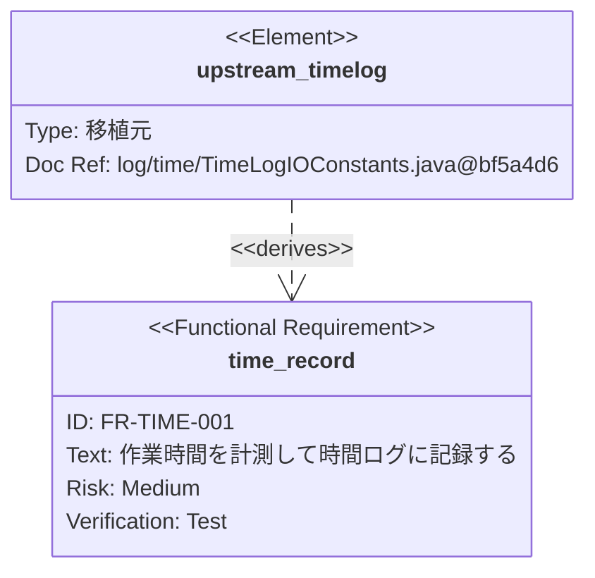

# ADR-0003: 作図記法を Mermaid に統一する

| 項目 | 内容 |
|---|---|
| ステータス | **承認** |
| 決定日 | 2026-07-20 |
| 決定者 | Kazuyuki Kuribayashi |
| 影響範囲 | 要求仕様の図表、アーキテクチャ仕様書、移植仕様書 |
| 関連 | [ipa-integration-proposal.md](../phase1/req/ipa-integration-proposal.md) |

---

## 1. 背景

IPA「機能要件の合意形成ガイド」は、技術領域ごとに「工程成果物」として具体的な図表を想定している。
Processloop はこれを網羅性の軸として取り込んだため、**図表をどの記法で書くか**を決める必要が生じた。

ガイド自身は特定の作図技法や表記法を規格として要求していない。
ガイド内の図表と表記法はあくまで一例であり、各社の開発標準に反映して利用できると明記されている。
したがって記法の選択は自由である。

候補は Mermaid、PlantUML、draw.io の3つである。

---

## 2. 決定

**Mermaid を標準の作図記法とする。** 表形式のものは Markdown 表で書く。

| 対象 | 記法 |
|---|---|
| 状態遷移・画面遷移・業務フロー・シーケンス・ER図・要求関連図 | **Mermaid** |
| 項目一覧・CRUD図・エンティティ定義 | **Markdown 表** |
| API 定義 | **OpenAPI（YAML）** |
| 画面レイアウト | **実装を正とする**（第1期） |

PlantUML と draw.io は第1期では採用しない。

---

## 3. 理由

### 決定的な理由：発注者が存在しない

draw.io の最大の利点は、非技術者と画面を見ながらマウス操作で修正できることである。
IPA ガイドが想定する「発注者と開発者が一緒にレビューする」場面で強く効く。

しかし [ipa-integration-proposal.md](../phase1/req/ipa-integration-proposal.md) で確認したとおり、
**Processloop は個人プロジェクトであり発注者が存在しない**。
合意の相手は「半年後の自分」であり、その相手は Mermaid を読める。

この前提の違いにより、draw.io の利点が働かない。
一方で Git の差分が読めることの価値は相対的に高くなる。

### Mermaid で足りる

第1期で必要な図は次のとおりで、すべて Mermaid が対応する。

| 必要な図 | Mermaid の記法 |
|---|---|
| 計測の状態遷移 | `stateDiagram-v2` |
| 画面遷移 | `flowchart` または `stateDiagram-v2` |
| 業務フロー | `flowchart`（`subgraph` で区分） |
| 処理の順序 | `sequenceDiagram` |
| データモデル | `erDiagram` |
| **要求間の関係** | **`requirementDiagram`** |

### ★ Requirement Diagram が Front Matter と対応する

Mermaid の Requirement Diagram は SysML v1.6 の仕様に従う。
その関係型が、Processloop の Front Matter とほぼ1対1で対応する。

| Mermaid の関係型 | Front Matter の項目 |
|---|---|
| `contains` | `parent` / `children`（USDM の要求分割） |
| `derives` | `source`（移植元から導出） |
| `satisfies` | `unit`（実装が要求を満たす） |
| `verifies` | `test_refs`（テストが要求を検証） |
| `traces` | `depends_on` |

さらに `element` の `docref` で外部文書の一部を指せるため、
**移植元の Java ファイルを要求に結び付けられる**。



<details>
<summary>ソースを見る</summary>

````markdown

````

</details>

**要求一覧の図は Front Matter から自動生成できる。** 手で維持するとずれるため、これは重要である。

### Markdown への埋め込みと GitHub での描画

Mermaid は Markdown 内にソースを直接書ける。GitHub 上でそのまま図として描画される。
要求仕様が1要求1ファイルの Markdown である以上、この性質が最も効く。

PlantUML と draw.io は別ファイルになり、参照が1段増える。

---

## 4. 検討した代替案

### 代替案1：PlantUML を併用する

**利点**：UML の表現力が高い。アクティビティ図、コンポーネント図、配置図などを厳密に書ける。
共通スタイルを定義して多数の図の表記を統一できる。

**却下理由**：Java 実行環境が必要になり、依存が増える。
Processloop は Node.js と pnpm で環境を統一しており、
[ADR-0001](adr-0001-data-collection-first.md) の方針からも余計な依存は避けたい。

第1期で必要な図は Mermaid で書ける範囲に収まる。

⚠️ ただし**将来 UML の厳密な表現が必要になった時点で再検討する**。
第2期のチーム機能では、複数利用者の相互作用を表すのに UML が有効かもしれない。

### 代替案2：draw.io で図を仕上げる

**内容**：Mermaid で生成し、必要な図だけ draw.io で調整する。

**確認した事実**：draw.io は Mermaid を編集可能な図形として取り込める。
スタイルとラベルの変更は Mermaid ソースを再生成しても保持されるが、
**サイズ・位置・線の経路の変更は上書きされる**。

**却下理由**：位置調整が保存されないため、仕上げの労力が再生成のたびに失われる。
そして前述のとおり、発注者がいないため見た目を整える動機が弱い。

`.drawio` の実体は XML であり、Git の差分が読めないことも不利に働く。

### 代替案3：画面レイアウトのために Penpot などを導入する

**却下理由**：第1期は画面が5つであり、**実装そのものを正とする**方針を既に採っている。
デザインツールを別に持つと、実装との二重管理になる。

---

## 5. 影響

### 変わるもの

| 対象 | 変更内容 |
|---|---|
| `ipa-integration-proposal.md` 統合点3 | 図表の記法を Mermaid に確定 |
| `req/README.md` | Mermaid の節を拡充。Requirement Diagram を追加 |
| **新規** `req/diagram-guide.md` | 工程成果物ごとの書き方 |

### 変わらないもの

- 18ユニットの定義、実装順序（ADR-0001）、計測方針（ADR-0002）
- USDM の記法と ID 体系（`FR-` / `NFR-` / `CON-`）
- API を OpenAPI で別管理する方針

### ⚠️ Mermaid の限界を受け入れる

| 限界 | 対処 |
|---|---|
| 図形の位置を座標で指定できない | 自動配置に委ねる。要素数が多い図は分割する |
| 画面レイアウトを描けない | 第1期は実装を正とする |
| 大きな一覧表に向かない | Markdown 表で書く |
| 描画環境によって使える機能が違う | GitHub が対応する範囲に留める |
| 識別子のハイフンが構文エラーになる | `id` と `text` を引用符で囲む（下記） |

⚠️ **Requirement Diagram では `id` と `text` を引用符で囲む。**
引用符なしだと `FR-TIME-001` のハイフンをパーサが解釈できず、
`Expecting 'NEWLINE', got 'LINE'` で構文エラーになる（Mermaid 11.16 で確認）。

要素数が増えると線の交差や横長化が起きやすい。
**図が読みにくくなったら、図を大きくするのではなく要求を分割する**という判断基準にする。

---

## 6. 経緯

| 日付 | 出来事 |
|---|---|
| 2026-07-20 | IPA ガイドの統合を決定。技術領域ごとの工程成果物を取り込む方針が固まる |
| 2026-07-20 | 図表の記法として Mermaid・PlantUML・draw.io を比較 |
| 2026-07-20 | draw.io の Mermaid 編集機能と、Mermaid の Requirement Diagram を一次資料で確認 |
| 2026-07-20 | **Mermaid への統一を承認。本 ADR として記録** |

---

## 7. 関連文書

| 文書 | 関係 |
|---|---|
| [../phase1/req/diagram-guide.md](../phase1/req/diagram-guide.md) | 工程成果物ごとの具体的な書き方 |
| [../phase1/req/ipa-integration-proposal.md](../phase1/req/ipa-integration-proposal.md) | 技術領域と工程成果物の定義 |
| [adr-0001-data-collection-first.md](adr-0001-data-collection-first.md) | 実装順序。依存を増やさない方針の背景 |
