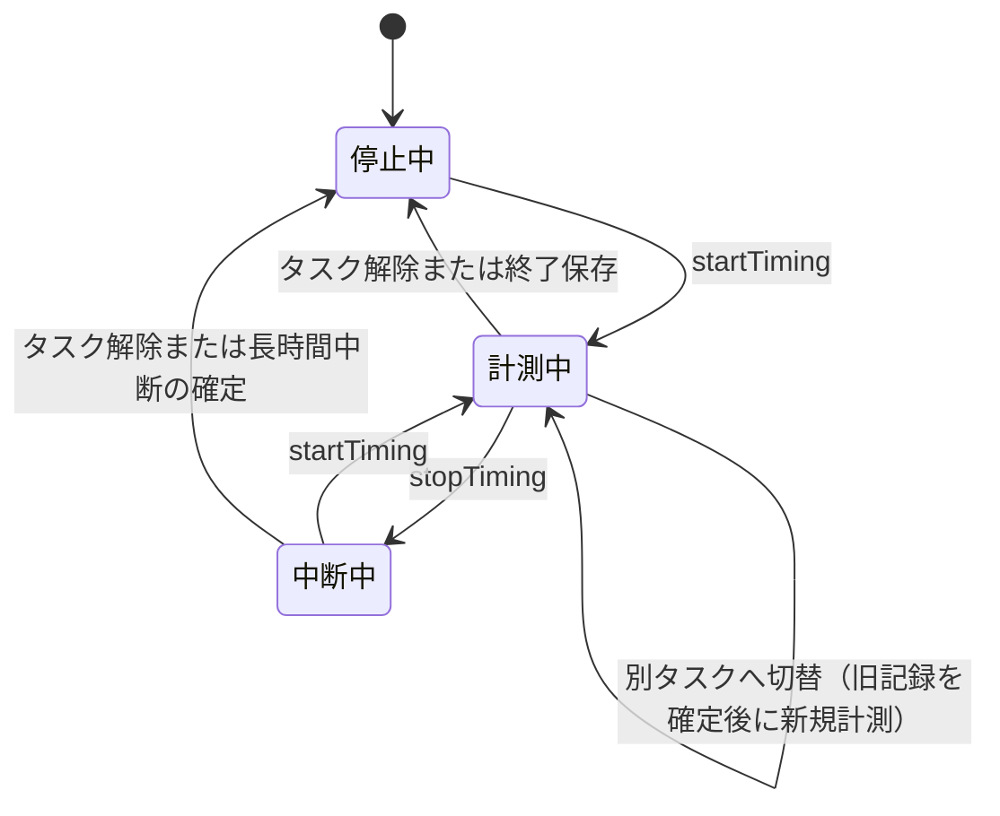

# 解析: B-4 時間ログ

移植元が時間計測を開始・中断・再開・終了し、時間ログへ保存する挙動を、
指定コミットの実装から記録する。第13章までは解析結果だけを扱い、移植先の設計は決めない。
第14章以降には、後続の移植仕様で確定した事項と解析ゲートの結果を記録する。

---

## 1. 対象と読んだ範囲

| ファイル | 全体 | 読んだ範囲 | 役割 |
|---|---:|---|---|
| `TimeLoggingModel.java` | 134行 | **全体** | 計測モデルの公開契約 |
| `DefaultTimeLoggingModel.java` | 524行 | **全体** | 状態遷移、タスク切替、丸め、保存の調整 |
| `Stopwatch.java` | 205行 | **全体** | 秒単位の作業時間と中断時間の計算 |
| `TimeLogEntry.java` | 50行 | **全体** | 保存レコードの読み取り契約 |
| `TimeLogEntryVO.java` | 188行 | **全体** | レコードの値オブジェクトと変更の合成 |
| `MutableTimeLogEntryVO.java` | 101行 | **全体** | 計測中レコードの更新 |
| `TimeLogIOConstants.java` | 43行 | **全体** | XMLの要素名・属性名・文字コード |
| `TimeLogWriter.java` | 142行 | **全体** | XML書き出し |
| `TimeLogReader.java` | 184行 | **全体** | XML読み込みと不正行の破棄 |
| `WorkingTimeLog.java` | 249行 | **全体** | 基本ログと変更ログの管理、統合 |
| `TimeLogModifications.java` | 492行 | 変更追加、読み込み、保存 | `timelog2.xml` の即時保存 |
| `DashboardTimeLog.java` | 207行 | **全体** | 計測可否と永続化への委譲 |
| `DefaultActiveTaskModel.java` | 137行 | **全体** | 選択ノードを末端へ解決する処理 |
| `PauseButton.java` | 395行 | **全体** | 開始・中断・再開操作と表示状態 |
| `ProcessDashboard.java` | 2591行 | 520〜710、1150〜1235、1510〜1580、1918〜1970、1990〜2130、2150〜2280行 | モデルの接続、個人画面、競合検知、終了保存 |
| `DashController.java` | 556行 | **全体** | Swingスレッド上のタスク選択・計測操作への入口 |
| `SaveableDataSource.java` | 33行 | **全体** | 保存可能なモデルの契約 |
| `ActiveTaskModel.java` | 72行 | **全体** | 選択タスクモデルの公開契約 |
| `HierarchyNavigator.java` | 611行 | **全体** | 階層メニューから末端タスクを選択する経路 |
| `TaskNavigationSelector.java` | 307行 | **全体** | 階層・タスクリスト・検索選択の切替と通知 |
| `QuickSelectTaskAction.java` | 252行 | **全体** | 検索結果の末端タスクを選択する経路 |
| `PercentSpentIndicator.java` | 553行 | ヘッダ、84〜183、250〜310行 | 計測状態と集計済み時間の画面表示 |
| `TaskTimeLoggingErrorWatcher.java` | 197行 | **全体** | 完了タスク・長時間計測の警告 |
| `Control.java` | 350行 | **全体** | 上流のHTTP操作入口 |
| `DisplayState.java` | 195行 | **全体** | 上流の計測状態・階層のHTTP出力 |
| `TaskStatusApi.java` | 170行 | **全体** | 上流Web APIの末端判定とエラー利用例 |
| `WebApiException.java` | 81行 | **全体** | 上流Web APIの構造化エラー |
| `WebApiUtils.java` | 65行 | **全体** | リクエスト元検証とエラー応答 |
| `DefaultTimeLoggingModelTest.java` | 519行 | **全体** | 開始・中断・タスク切替・境界条件の上流テスト |
| `MockActiveTaskModel.java` | 98行 | **全体** | 上流テスト用の選択タスクモデル |

`TimeLogTableModel`、インポート、ロールアップ、集計、同期メッセージ、
時間ログ編集画面は、既存記録の編集・集計・同期を主目的とし、計測の中核ではないため読んでいない。

## 2. 著作権とライセンス

対象30ファイルのヘッダを個別に確認した。すべて著作権者は
**Tuma Solutions, LLC** であり、GNU GPL version 3 またはそれ以降、ならびに
上流 `README-license.txt` の追加許諾を掲げている。

| 範囲 | 著作権年 |
|---|---|
| 計測・永続化の中核 | 2003〜2020（ファイルごとに異なる） |
| `Stopwatch.java` | 1998〜2016 |
| `DefaultActiveTaskModel.java` | 2005〜2009 |
| `PauseButton.java` | 2000〜2017 |
| 第3段階Aで追加したアプリ配線・階層UI・Webコード | 1998〜2025（ファイルごとに異なる） |
| 第3段階Aで追加した上流テスト | 2005〜2016（ファイルごとに異なる） |

Tuma Solutions 以外の著作権表示、LGPL、Apache License、Sun Microsystems の表示は、
今回の対象ファイルにはなかった。したがって対象はGPLv3本体コードの層に属する。
これは法的助言ではなく、各ファイルのヘッダを確認した技術的な棚卸し結果である。

## 3. 状態と状態遷移

移植元は列挙型を持たず、`paused`、`stopwatch`、`Stopwatch.startTime` の組で状態を表す。

| 状態 | `paused` | `stopwatch` | `Stopwatch.startTime` |
|---|---:|---|---|
| 停止中（未計測） | `true` | `null` | — |
| 計測中 | `false` | 非`null` | 非`null` |
| 中断中 | `true` | 非`null` | `null` |



- `setPaused(true)` は `stopTiming()`、`setPaused(false)` は `startTiming()` を呼ぶ。
- 同じ `PropertyKey` の再選択は `setCurrentPhase` が何もせず返す。
- 別タスクへ切り替えると、現在のレコードを保存・解放してから新しいStopwatchを作る。
- 計測可否を満たさないタスクでは開始せず、実行中なら中断状態にする。
- 他クライアントが後から始めた記録を検知すると、重複区間を打ち切って現在の記録を確定する。

`PauseButton` は中断中と計測中でアイコン、選択状態、ツールチップを変える。
計測不可のタスクではボタンを無効にする。

## 4. タスク選択と計測可否

`DefaultActiveTaskModel.setNode` は、子を持つノードが渡されると、各階層で選択済みの子
（不正なら先頭の子）をたどり、末端ノードへ変換する。

ただし `DashboardTimeLog.timeLoggingAllowed` は、子を持つノードを無条件には拒否しない。
そのノードに `Time_Logging_Allowed` が真で明示されていれば計測を許可する。
ほかに次の条件では拒否する。

- ノード、階層、データコンテキストのいずれかがない。
- 読み取り専用モードである。
- 禁止パスまたはその配下に一致する。
- `Time` が計算値として定義されている。

したがって「末端ノードのみ」という規則は通常の選択経路では成立するが、
移植元全体の計測可否には明示的な例外がある。

## 5. 時間計算

`Stopwatch` は内部値を秒で持ち、システム時計 `new Date()` の差を整数除算で秒へ変換する。

### 作業時間

- 開始時に `startTime` を設定する。
- 中断時に `stopTime - startTime` を `elapsedTime` へ加え、`startTime` を `null` にする。
- 再開後の区間は次の中断時または参照時に加算する。
- 中断中の時間は `elapsedTime` に入らない。

⚠️ 移植元の `delta` は、開始から終了までの総経過時間ではない。
**中断中を除いてStopwatchが積算した作業時間**である。
移植元は「総経過時間から中断時間を引く」という式を保存時に実行していない。

### 中断時間

再開時に `startTime - stopTime` を `interruptTime` へ加える。
複数回の中断は同じ値へ累積する。中断中に参照する
`runningMinutesInterrupt()` だけは、現在時刻までの未確定中断も加えて返す。

一方、保存に使う `minutesInterrupt()` は確定済みの `interruptTime` だけを返す。
中断操作直後の保存では直前までの作業時間は保存されるが、その時点から続く中断時間はまだ保存されない。

### 倍率

計測モデルには `multiplier` があり、作業時間と中断時間の両方に乗算される。
文字列から倍率を設定する場合、数値でなければ例外を外へ出さず `1.0` のままにする。

## 6. 中断の確定と長時間中断

中断したまま通常の再開を行えば、再開時点までが中断時間へ加算される。
ただし長時間の末尾中断には別の処理がある。

中断中かつ現在レコードが存在し、未確定中断が次の両方を満たすと、
現在レコードを保存・解放する。

- 5分を超える。
- 保存済み作業時間の25%を超える。

この処理は定期タイマーと再開直前に呼ばれる。解放後は `stopwatch` が `null` になるため、
その長い末尾中断は既存レコードの `interrupt` に加えられない。再開すると新しい計測になる。

⚠️ したがって「中断したまま終了した場合は終了時刻までを常に中断時間へ含める」挙動は、
移植元から一律には確認できない。`saveData()` もタスクを解除して保存するが、
未確定の末尾中断を `interruptTime` へ移す処理は呼ばない。

## 7. 丸め処理

作業時間は分の小数値に対して `long(elapsedMinutes + 0.5)` を使い、
**最も近い整数分へ丸める（0.5分以上を切り上げる）**。

ただし初回レコードは、丸め後の値ではなく丸め前の `elapsedMinutes < 1.0` を判定し、
1分未満なら作成しない。このため通常は次のようになる。

| 作業時間 | 保存結果 |
|---|---|
| 0分以上1分未満 | レコードを作らない |
| 1分以上1.5分未満 | `delta=1` |
| 1.5分以上2.5分未満 | `delta=2` |

タスクを完了にした直後など、限定条件では1分未満でも強制的に `delta=1` を作る。
設定 `pauseButton.forceCompletedTaskTime`、継承値 `Force_Completed_Task_Time`、
完了時刻から1秒未満かどうかが判定に関与する。

⚠️ `shouldForceTimeLogEntry` は `Time` のデータ名を組み立てるが、その値を取得せず、
直前に取得した `Force_Completed_Task_Time` を再度判定している。コメントは
「過去に時間があれば強制しない」と説明するものの、実装がその判定を行っているとは確認できない。
不具合か意図的挙動かは判断しない。

中断時間は `minutesInterrupt()` の `long` キャストにより**小数部を切り捨てる**。
作業時間と中断時間は別々の方法で丸められる。

## 8. 保存形式と保存の流れ

### XML形式

文字コードはUTF-8、ルート要素は `<timeLogEntries>`、各レコードは空要素 `<time>` である。

```xml
<?xml version="1.0" encoding="UTF-8"?>
<timeLogEntries>
  <time id="1" path="/Project/Code" start="@1786665600000" delta="12" interrupt="3" comment="..."/>
</timeLogEntries>
```

| 属性 | 内容 | 省略条件 |
|---|---|---|
| `id` | 正の識別子 | 0なら省略 |
| `path` | 階層パス | `null`なら省略 |
| `start` | `@` + Unix epochミリ秒 | `null`なら省略 |
| `delta` | 中断を除いて積算した作業時間（分） | 0なら省略 |
| `interrupt` | 確定済み中断時間（分） | 0なら省略 |
| `comment` | コメント | `null`なら省略 |
| `flag` | 変更種別。文字集合は `" AMDR"` | 変更なしなら省略 |

⚠️ 開始時刻はISO 8601ではなく、タイムゾーン情報を持たないepochミリ秒表現である。
XMLの改行は実行環境の `line.separator` を使用する。

### 二段階の保存

- `timelog.xml` は統合済みの基本ログである。
- `timelog2.xml` は追加・変更・削除とパス改名を保持する変更ログである。
- 計測中の更新は `TimeLogModifications.addModification` から変更ログへ即時保存される。
- 起動時などのクリーンアップで両者を統合し、一時ファイルとチェックサムを使って
  `timelog.xml` を置き換え、変更ログを空にする。
- ファイルがなければ空のXMLを作る。IDは既存ログを走査した最大値から増加させる。

## 9. 例外条件と不正データ

| 条件 | 移植元の挙動 |
|---|---|
| XMLパーサ／シリアライザを生成できない | `RuntimeException` |
| XMLの読み取り中にI/Oまたは構文エラー | 反復処理を閉じ、I/Oを包む実行時例外を投げる |
| 個々の `<time>` の属性が不正 | 警告を標準出力へ出し、その1件だけ破棄して続行 |
| `id=0`（一括変更を除く） | 不正レコードとして破棄 |
| 数値属性がない | 0として読む |
| 未知の `flag` | 変更なし（0）として読む |
| 読み取り専用モード | 保存せず `false` を返す |
| `timelog2.xml` の保存失敗 | 標準エラーへ出し `false` を返す。呼び出し元へは投げない |
| 統合後のチェックサム不一致 | 出力を中止し `IOException` |
| 変更種別を持たない変更を追加 | `IllegalArgumentException` |
| ID採番元がない | `IllegalStateException` |

値オブジェクトとXML読み込みには、負の `delta`／`interrupt`、未来の `start`、
`interrupt > delta`、パスやコメントの長さを拒否する検証がない。

## 10. 他ユニットとの依存

| 対象 | 移植元での関係 |
|---|---|
| B-2 階層 | `ActiveTaskModel` と `PropertyKey` から対象パスを得る。通常は選択を末端へ解決する。パス改名は時間ログの変更命令にも反映される |
| B-9 永続化 | B-4が作るパス、開始時刻、`delta`、`interrupt`、コメントを保存する。移植先では `timeLog.create` が境界になる |
| B-3 プロセス定義 | 直接の型依存はない。階層に展開されたフェーズが計測対象になる |
| データリポジトリ／計算式 | `Time_Logging_Allowed`、`Time`、`Force_Completed_Task_Time`、`Completed` を参照し、計測可否と1分への強制丸めを決める |
| C 画面 | `PauseButton` が開始・中断・再開を操作し、状態をアイコン等で表示する |
| 同期・外部クライアント | 後発の記録を受けると重複区間を打ち切り、必要なら選択タスクも変更する |

`packages/core` に移すべき中核はUI非依存の計測状態と時間計算であり、
Swingのタイマーやボタン表示は画面側の関心である。ただし、これは依存境界の観察であり、
本解析では移植先の関数構成を決めない。

## 11. 画面操作から保存までの経路

### 11.1 起動時の接続

`ProcessDashboard` は階層を読み込んだ後に `DefaultActiveTaskModel` を作り、
`DashboardTimeLog` の `TimeLoggingModel` へ渡す。その後に `PauseButton`、
`TaskNavigationSelector`、`TaskTimeLoggingErrorWatcher` を同じモデルへ接続する。
したがって選択タスクと計測状態は別々の画面部品が持つ値ではなく、
`ActiveTaskModel` と `TimeLoggingModel` が共有する状態である。

### 11.2 タスク選択

通常の階層メニューでは `HierarchyNavigator.HierMenuItem` が選択された子を更新し、
子を持つ限り選択済みの子をたどる。末端へ到達すると
`ActiveTaskModel.setNode` を呼ぶ。検索選択では `QuickSelectTaskAction` が
選択された末端のパスを `ActiveTaskModel.setPath` へ渡す。

`DefaultActiveTaskModel` は親ノードを受け取っても、各階層の選択済みの子、
または選択位置が不正な場合は先頭の子をたどって末端へ解決する。変更後は各親の
選択位置を更新し、プロパティ変更を通知する。

`DefaultTimeLoggingModel.ExternalChangeListener` はこの通知を受け、次の順序で処理する。

1. 旧タスクに現在行があれば保存し、現在行とStopwatchを解放する。
2. 新しい末端タスクを現在タスクにする。
3. 変更前が計測中なら、新しいStopwatchを作って新しいタスクの計測を続ける。
4. アクティブタスク変更イベントを通知し、画面を更新する。

同じタスクを再選択した場合は何も行わない。存在しないパスやフェーズを
`PauseButton` 経由で選んだ場合は計測を中断し、警告音を鳴らして失敗を返す。

### 11.3 開始・中断・再開・終了保存

`PauseButton` の再生操作は `setPaused(false)` から `startTiming` を呼び、
中断操作は `setPaused(true)` から `stopTiming` を呼ぶ。`startTiming` は初回開始と
中断後の再開を兼ねる。`stopTiming` はStopwatchを止めて現在行を保存するが、
現在行を解放しないため、利用者の明示的な「計測終了」ではなく中断に相当する。

移植元の主画面には、現在の計測を独立して正式終了するボタンがない。現在行を
解放して区切る主な経路は別タスクへの切替、長時間の末尾中断、全データ保存である。
通常終了では `ProcessDashboard.quit` が `saveAllData` を呼び、
`saveTimeLogData` が中断、現在行の解放、時間ログの保存を順に行う。別端末のロックを
検知して強制終了する場合も、先に計測を中断して全データを保存する。

### 11.4 定期保存と画面表示

`DefaultTimeLoggingModel` のSwingタイマーは、開始から約1分後に最初の更新を行う。
1分の現在行が作られるまでは5秒間隔で境界を確認し、作成後は通常1分間隔へ戻る。
`handleTimerEvent` は現在行を更新し、変更ログを即時保存する。

`PauseButton` は計測可否、計測中、中断中に応じて有効状態、選択状態、アイコン、
ツールチップを変える。`PercentSpentIndicator` は集計済みの実績時間や見積り比率を
表示できるが、現在セッションの正味時間を時分秒で表示する部品ではない。

`TaskTimeLoggingErrorWatcher` は計測開始の20秒後、その後は1時間間隔で、完了済み
タスクへの計測と長時間継続を警告する。利用者が継続しない場合は `stopTiming` で
中断する。最近使ったパス、警告音、倍率、完了タスク警告、長時間警告は設定値を持つ。

### 11.5 上流テストで確認した範囲

`DefaultTimeLoggingModelTest` は開始・中断・再開、計測中のタスク切替、同じタスクの
再選択、計測不可パスへ変更した場合の自動中断、長い末尾中断、停止済み状態への
再停止を検証している。一方、階層編集中の改名や計測可否変更を含む
`ActiveTaskModel` 差替えには `FIXME_TIMELOG` が残る。第3段階で扱う末端選択と
通常のタスク切替は実装とテストの両方で確認でき、階層編集中の差替えは対象外である。

## 12. 移植元のWeb制御とエラー

### 12.1 HTTPから計測モデルまで

`Control` はPOSTされたスクリプト名から操作を判別する。`setPath` はSwingの
イベントディスパッチスレッドで同期実行し、パスと任意のフェーズの選択に成功した
場合だけ、指定があれば `startTiming` を非同期に要求する。単独の `startTiming` と
`stopTiming` も `DashController` を経由してSwingスレッド上の
`TimeLoggingModel` へ委譲する。

このWeb制御の `stopTiming` も正式終了ではなく中断である。成功時は通常、状態を
含まない空文書を返す。パス選択と計測開始を一体のトランザクションにはしていない。

`DisplayState.getTimingState` は次の2値だけをプレーンテキストで返す。

- `activeTask`: 選択中のパス。
- `isTiming`: `paused` の反転値。

正味時間、中断時間、開始時刻、更新番号は返さない。階層取得は別経路でXMLの木を返し、
要求された場合はパスと末端判定を属性に含める。

### 12.2 上流Web APIの入力検証とエラー

`TaskStatusApi` は時間計測APIではないが、対象パスが存在し、末端であることを
サーバ側で検証する実例である。パス未指定時は現在の選択タスクを使い、存在しなければ
404、親ノードなら400を返す。

`WebApiException` はHTTP状態、エラーコード、説明、属性を保持し、`stat=fail` と
`err` を持つJSONへ変換する。`WebApiUtils` は個別設定で許可されていない限り、
ローカル以外の送信元を拒否する。説明文を応答に含める点は、メッセージキーだけを返す
移植先のi18n方針とは異なる。

## 13. 直接対応がないWeb固有挙動

移植元全体で、主画面、既存Web制御、状態取得、Web APIの候補を検索した。
第3段階B・Cに必要な次の挙動には直接対応する実装がない。

| 移植先で必要な挙動 | 移植元で最も近い挙動 | 直接対応がない根拠 |
|---|---|---|
| 明示的な計測終了 | タスク切替または全データ保存で現在行を解放 | 主画面と`Control`の停止操作は中断であり、終了専用操作がない |
| 未終了セッションの復元 | 現在行を通常1分間隔で正式ログへ更新 | 新しいモデルは`paused=true`、Stopwatchなしで起動し、実行状態を復元しない |
| 1秒ごとの正味時間表示 | 集計済み実績時間、計測中アイコン | `TimeLoggingModel`と既存状態APIは現在区間の表示値を公開しない |
| チェックポイントAPI | Swingタイマーによる現在行の更新 | クライアント区間を受け取るAPIがない |
| 楽観ロックと409 | 外部追加時に時刻を比較して重複を打ち切る | 複数画面が同じセッションを更新するversion契約がない |
| ブラウザ再読込み | デスクトッププロセスが状態を保持 | ブラウザのライフサイクル自体がない |
| 計測終了時のコメント入力 | 自動作成する現在行のコメントは`null` | `PauseButton`と既存Web制御にコメント入力がない |

したがって、専用の `stop`、`ActiveTimeSession`、1秒表示、チェックポイント、復元、
version競合はWeb化のための追加である。移植元の利用者目的に最も近いタスク選択、
開始・中断・再開、定期保存、終了保存の順序を保ち、技術要素だけを置き換える必要がある。

## 14. 移植仕様で確定した事項

以下は解析時には確認事項だったが、`PRT-B4` の作成時に確定した。
移植先の詳細な根拠とテスト仕様は
[prt-b4-time-log.md](../phase1/units/prt-b4-time-log.md)を正本とする。

| 項目 | 移植元で確認した事実 | 確定した移植方針 |
|---|---|---|
| `delta` の意味 | 中断を除いて積算した作業時間 | 作業区間を直接積算し、保存時に中断を再度引かない |
| 1分未満 | 通常はレコード自体を作らない。限定条件では1分を作る | 新規計測では非保存。移行済みの0分値は保持する |
| 作業時間の丸め | 1分到達後は四捨五入 | 四捨五入を維持する |
| 中断時間の丸め | 分未満を切り捨て | 切り捨てを維持する |
| 末尾中断 | 未確定の末尾中断を含めない場合がある | 明示終了では終了まで含める。既存ログは補正しない |
| `interrupt <= delta` | 検証せず、実際に超過しうる | 制約を設けない。通常操作では非負値を生成し、移行値は拒否しない |
| 開始時刻 | XMLではepochミリ秒 | サーバ生成UTCとし、APIはISO 8601。移行時は同じ瞬間へ変換する |
| 親ノードの計測 | 明示マーカーがあれば許可 | M1は末端限定。M3以降に例外を追加できる設計とする |
| 倍率 | 作業時間と中断時間へ適用 | M1では実装せず、移行値を再計算しない |
| 完了直後の1分強制 | コメント上の既存時間判定と実装が一致しない | M1では実装せず、必要時に別要求として定義する |
| 1秒ごとの表示 | 中核モデルは通常1分間隔で保存更新する | 正味作業時間だけを毎秒表示し、総経過時間は表示しない |
| システム時計の逆行 | `Date` の差をそのまま使う | 表示区間は単調時計、永続時刻と復元はサーバ時計を使う |
| ブラウザ障害 | デスクトッププロセス内の状態を定期保存する | 操作時と通常1分間隔でサーバへ保存し、未終了セッションを復元する |

## 15. 第3段階Aの解析ゲート

第3段階B・Cの影響範囲を、階層選択、画面イベント、HTTP境界、状態遷移、
定期保存、終了保存、エラー、再読込み、競合、総合テストとして再監査した。

| 確認項目 | 結果 | 根拠 |
|---|---|---|
| 上流SHAと手元の一致 | **PASS** | `bf5a4d63aff08410f79840001c816b37392e5001` で一致 |
| 対象ファイルとイベント経路 | **PASS** | 第1章と第11・12章でファイル、クラス、呼出し順序を特定 |
| 状態、境界、失敗、保存 | **PASS** | 第3〜9章と上流テストで確認 |
| UI・Web・モデル・永続化の隣接処理 | **PASS** | 選択から終了保存までを第11章で追跡 |
| Web固有機能の対応候補検索 | **PASS** | 直接対応がない機能と検索結果を第13章に記録 |
| 全対象ファイルのヘッダ | **PASS** | 30ファイルすべてTuma Solutions、GPLv3以降 |
| 第三者・CMU特別許諾物の混入 | **PASS** | 対象30ファイルのヘッダに該当表示なし |
| 移植元との差異と理由 | **PASS** | 第14章とPRT-B4に記録 |
| 今回へ影響する未確認事項 | **PASS** | 階層編集中の差替えと同期は第3段階B・Cの対象外 |
| 要求・ARC・PRT・テストへの追跡 | **PASS** | FR-TIME-001、ARC 6.4・7・8、PRT-B4へ接続 |

解析ゲートは **PASS** とする。第3段階BではOpenAPIの具体的な入出力、
Next.js依存のライセンス、第3段階CではReactの画面構成とPlaywrightのテスト設備を
確定する。これらは上流挙動の未確認ではなく、Web化後の実装設計として後続段階で扱う。

最近使ったパス、タスクリスト切替、警告音、倍率、完了タスク警告、長時間計測警告、
階層編集中のモデル差替え、外部クライアント同期はM1の第3段階B・Cへ含めない。
将来追加する場合は要求を定義し、その作業範囲で解析ゲートを再実行する。
