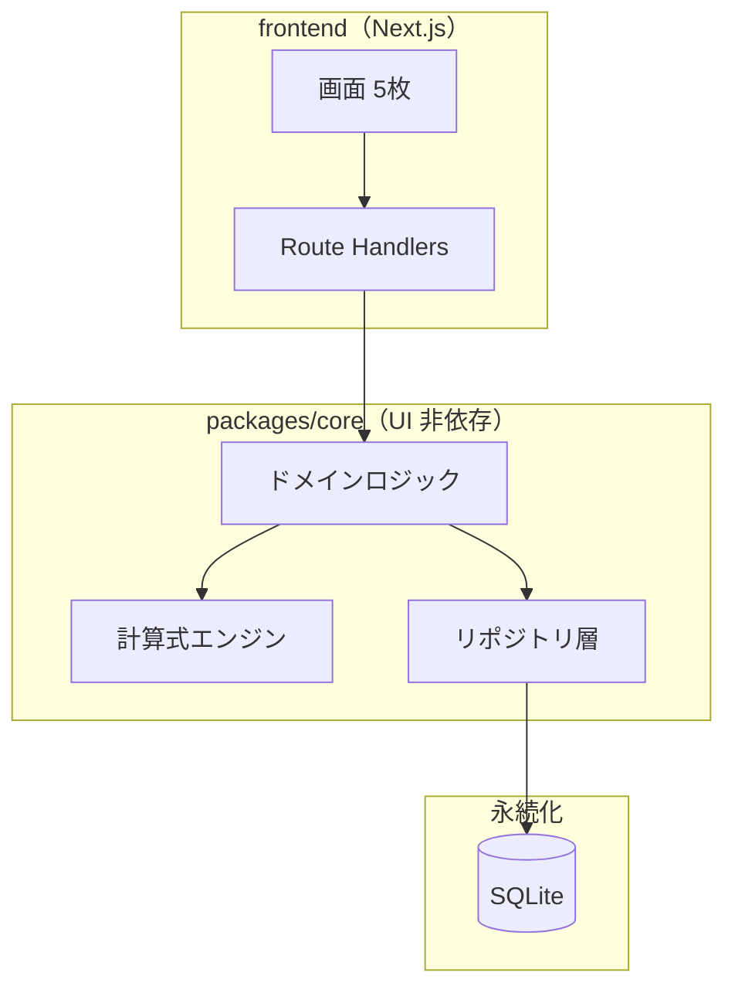
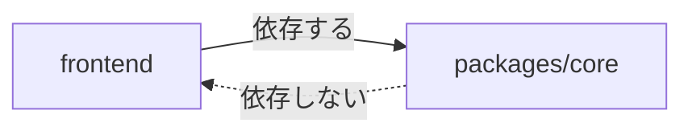
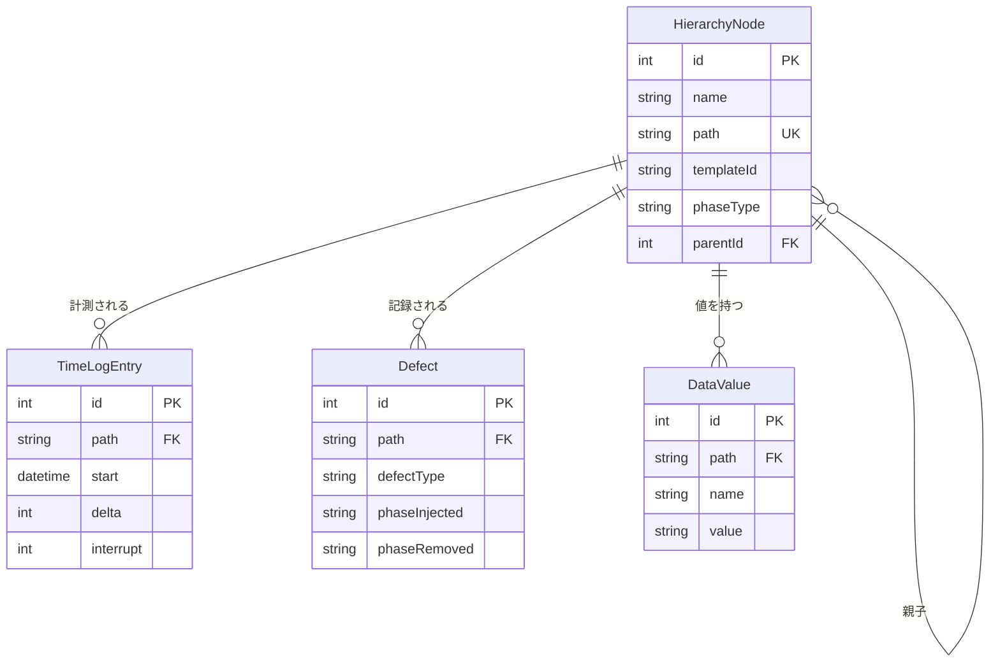
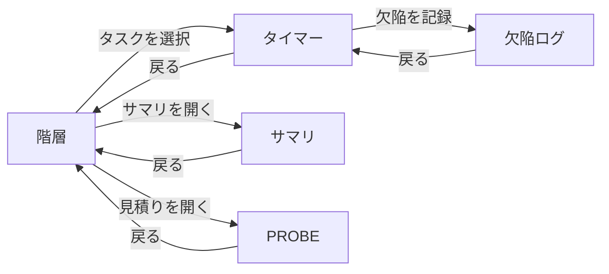

# Processloop アーキテクチャ仕様書（第1期）

移植先 Processloop を**どういう構造で作るか**を定める。

⚠️ 移植元 Process Dashboard の解析は [architecture-analysis.md](../architecture-analysis.md) にある。
本書は移植先の設計であり、両者は別の文書である。

```
https://github.com/ChestnutForest/processloop/blob/main/docs/architecture-analysis.md
```

---

## 本書の状態

**段階2まで記述済み。** 段階3（計算式エンジン）は M3 着手前に書く。

工程ゲート G1 の条件は「要求仕様と ARC が承認され、TM の骨格ができている」であり、
ARC の完成を求めていない。IPA の合意成熟度でも、仕掛レベルは
一覧と共通ルールが揃った状態を指す。

段階の定義と分割の根拠は [arc-outline.md](arc-outline.md) を参照。

```
https://github.com/ChestnutForest/processloop/blob/main/docs/phase1/arc-outline.md
```

| 章 | 段階1 | 段階2 | 段階3 |
|---|---|---|---|
| 1 本書の位置づけ | ✅ | | |
| 2 全体構成 | ✅ | | |
| 3 データモデル | ✅ 一覧とER図 | ✅ 属性・スキーマ・CRUD図 | |
| 4 計算式エンジン | | | ⬜ M3 着手前 |
| 5 永続化 | | ✅ | |
| 6 画面 | ✅ 一覧と遷移 | ✅ 構成の詳細 | |
| 7 API | | ✅ | |
| 8 テスト方式 | ✅ 境界の定義 | | |
| 9 横断的な方針 | | ✅ | |
| 10 決定の一覧 | ✅ ADR参照 | | |

---

## 1. 本書の位置づけ

### 1.1 目的と範囲

第1期（個人の PSP 機能 ＋ PROBE ＋ EV）を対象とする。
チーム機能と周辺ツールは対象外であり、第2期以降に別途定める。

### 1.2 上位文書との関係

```
移植元の解析 → 要求定義 → アーキテクチャ設計 → プログラム設計 → 実装
     ↑              ↑              ↑                  ↑
architecture-  FR/NFR/CON      本書（ARC）        PRT-xx（未作成）
analysis.md
```

| 文書 | 関係 |
|---|---|
| [overview.md](req/overview.md) | 目的・範囲・用語・共通ルール。本書は用語を再定義しない |
| [FR/NFR/CON](req/) | 要求仕様。本書は要求を実現する構造を定める |
| [architecture-analysis.md](../architecture-analysis.md) | 移植元の解析。本書の設計判断の根拠 |
| [ADR](../adr/) | 個別の設計決定とその経緯 |

**要件定義の概要**（用語集と共通ルール）

```
https://github.com/ChestnutForest/processloop/blob/main/docs/phase1/req/overview.md
```

**要求仕様の一覧**

```
https://github.com/ChestnutForest/processloop/blob/main/tree/main/docs/phase1/req
```

**移植元の解析報告**

```
https://github.com/ChestnutForest/processloop/blob/main/docs/architecture-analysis.md
```

**決定記録（ADR）**

```
https://github.com/ChestnutForest/processloop/blob/main/tree/main/docs/adr
```

### 1.3 用語

[overview.md](req/overview.md) の用語集に従う。**本書では再定義しない。**

---

## 2. 全体構成

### 2.1 層構成



<details>
<summary>ソースを見る</summary>

````markdown

````

</details>

### 2.2 `packages/core` を分離する理由

**根拠は移植元の構造にある。** 移植元の `data` パッケージは171ファイル中、
Swing に依存するものが1ファイルしかない（0.6%）。
ロジックと UI が既に分離されており、その構造を保つのが自然である。

実測の出典は解析報告の「UI とロジックの分離度」にある。

```
https://github.com/ChestnutForest/processloop/blob/main/docs/architecture-analysis.md
```

分離により次を得る。

| 利点 | 内容 |
|---|---|
| テストが書きやすい | UI を起動せずドメインロジックを検証できる |
| 移植の検証が容易 | ゴールデンファイルとの突き合わせが UI と無関係に行える |
| 将来の選択肢 | チーム機能で負荷が増えたら独立サーバへ切り出せる |

### 2.3 依存の方向

**`packages/core` は frontend に依存しない。** 一方向の依存とする。



<details>
<summary>ソースを見る</summary>

````markdown

````

</details>

`packages/core` に React や Next.js の import が現れたら設計違反とする。

### 2.4 モノレポ構成

pnpm workspaces を用いる。

```
processloop/
├─ packages/core/     UI 非依存のドメイン層
├─ frontend/          Next.js アプリケーション
├─ i18n/              多言語メッセージ（en / ja）
└─ scripts/           検証スクリプト
```

pnpm を選ぶ理由は、npm の巻き上げによる**幽霊依存**（package.json に宣言していない
依存を import できてしまう状態）を構造的に防ぐためである。
シンボリックリンクで正しい依存階層を表現する。

---

## 3. データモデル

### 3.1 エンティティ一覧

第1期で扱うのは4つである。

| # | エンティティ | 役割 | M1 | 移植元の対応 |
|---|---|---|---|---|
| 1 | **HierarchyNode** | プロジェクトの階層。タスクとフェーズ | ✅ | `state` ファイル（XML） |
| 2 | **TimeLogEntry** | 作業時間の記録 | ✅ | `timelog.xml` |
| 3 | **Defect** | 欠陥の記録 | M2 | `*.def` |
| 4 | **DataValue** | 計算式が扱う値 | ⚠️ M3 | `*.dat` |

⚠️ **`DataValue` は M3 で確定する。** 計算式エンジンが扱う値を保持するモデルであり、
エンジンの設計に依存する。M1 と M2 では使用しない。
段階2で属性を定義する際も、最小限にとどめて M3 で拡張する方針を採る。

移植元の永続化4系統（`state` / `timelog.xml` / `*.def` / `*.dat`）の解析は解析報告にある。

```
https://github.com/ChestnutForest/processloop/blob/main/docs/architecture-analysis.md
```

### 3.2 ER図



<details>
<summary>ソースを見る</summary>

````markdown

````

</details>

⚠️ 図の `DataValue` は M3 で確定するため、属性は暫定である。

### 3.3 パスによる結合

**移植元では全データが `path`（階層パス）で結び付いている。** この設計を引き継ぐ。

```
/MyProject/Design      ← HierarchyNode の path
```

`TimeLogEntry` `Defect` `DataValue` はいずれも `path` を持ち、対象のノードを指す。

移植先では `path` に加えて**外部キーでも結ぶ**。理由は整合性の担保である。
移植元は文字列の一致だけで結んでおり、ノード名を変えるとリンクが切れる恐れがある。

⚠️ ノード名の変更時は、配下すべてのパスを付け直す必要がある
（要求仕様 `FR-HIER-001.520`）。

```
https://github.com/ChestnutForest/processloop/blob/main/docs/phase1/req/fr-hier-001.md
```

### 3.4 計算結果を保存しない

**派生指標（歩留まり、欠陥密度、CPI、SPI）はデータベースに保存せず、都度計算する。**

移植元の `DataRepository` が、値の変更を検知して依存する値を自動再計算する
リアクティブな設計を採っているためである。計算結果を保存すると、
元データの変更時に整合を保つ責任が生じ、設計が二重になる。

保存するのは**実測値のみ**とする。

| 保存する | 保存しない |
|---|---|
| 作業時間、中断時間 | 合計時間、フェーズ別の配分 |
| 欠陥の混入・除去フェーズ | 歩留まり、欠陥密度 |
| 見積り規模、実績規模 | PROBE の回帰結果 |

### 3.5 エンティティの定義

#### HierarchyNode

| # | 属性 | 型 | 桁 | 必須 | 範囲・制約 | 説明 |
|---|---|---|---|---|---|---|
| 1 | id | Int | — | ✅ | 自動採番 | 主キー |
| 2 | name | String | 200 | ✅ | 1文字以上。同一の親の下で重複不可 | ノード名 |
| 3 | path | String | 1000 | ✅ | 先頭が `/`。区切りは `/`。全体で一意 | 階層パス |
| 4 | templateId | String | 50 | | `PSP2` など | プロセス定義の識別子 |
| 5 | phaseType | String | 20 | | `plan` `dld` `dldr` `code` `cr` `comp` `ut` `pm` | フェーズ種別 |
| 6 | parentId | Int | — | | 自己参照 | 親ノード |
| 7 | sortOrder | Int | — | ✅ | 0以上 | 兄弟内の順序 |
| 8 | createdAt | DateTime | — | ✅ | — | 作成日時 |
| 9 | updatedAt | DateTime | — | ✅ | — | 更新日時 |

⚠️ **`phaseType` は文字列で持つ。** 列挙型にすると、移植元がフェーズ種別を追加したときに
マイグレーションが必要になる。移植元の `PhaseUtil` が文字列で判定していることにも合わせる。

#### TimeLogEntry

| # | 属性 | 型 | 桁 | 必須 | 範囲・制約 | 説明 |
|---|---|---|---|---|---|---|
| 1 | id | Int | — | ✅ | 自動採番 | 主キー |
| 2 | nodeId | Int | — | ✅ | 外部キー | 対象ノード |
| 3 | path | String | 1000 | ✅ | — | 記録時点の階層パス |
| 4 | start | DateTime | — | ✅ | 未来時刻を許さない | 計測開始 |
| 5 | delta | Int | — | ✅ | 0以上 | **正味時間（分）** |
| 6 | interrupt | Int | — | ✅ | 0以上 `delta` 以下 | **中断時間（分）** |
| 7 | comment | String | 1000 | | — | コメント |
| 8 | createdAt | DateTime | — | ✅ | — | 記録日時 |

**`path` を外部キーと併せて持つ理由**は2つある。移植元が `path` で結ぶ設計であり
既存データの移行時に対応が取れること、そしてノード名の変更前の位置を保てることである。

#### Defect（M2）

| # | 属性 | 型 | 桁 | 必須 | 説明 |
|---|---|---|---|---|---|
| 1 | id | Int | — | ✅ | 主キー |
| 2 | nodeId | Int | — | ✅ | 対象ノード |
| 3 | number | String | 20 | ✅ | 欠陥番号 |
| 4 | defectType | String | 30 | ✅ | PSP 標準10種 |
| 5 | phaseInjected | String | 50 | ✅ | 混入フェーズ |
| 6 | phaseRemoved | String | 50 | ✅ | 除去フェーズ |
| 7 | fixTime | Int | — | | 修正時間（分） |
| 8 | fixDefect | String | 20 | | 関連する欠陥番号 |
| 9 | fixCount | Int | — | ✅ | 既定値 1 |
| 10 | fixPending | Boolean | — | ✅ | 既定値 false |
| 11 | description | String | 2000 | | 内容 |
| 12 | date | DateTime | — | ✅ | 発見日時 |

#### DataValue（M3）

⚠️ **M3 で確定する。** 計算式エンジンが扱う値を保持するモデルであり、
エンジンの設計に依存する。M1 と M2 では使用しない。

現時点で確定しているのは、`path` と名前の組で値を特定することのみである。

### 3.6 Prisma スキーマ

M1 で必要な2モデルを示す。`Defect` と `DataValue` は各マイルストーンで追加する。

```prisma
datasource db {
  provider = "sqlite"
  url      = env("DATABASE_URL")
}

generator client {
  provider = "prisma-client-js"
}

model HierarchyNode {
  id         Int      @id @default(autoincrement())
  name       String
  path       String   @unique
  templateId String?
  phaseType  String?
  sortOrder  Int      @default(0)
  createdAt  DateTime @default(now())
  updatedAt  DateTime @updatedAt

  parentId   Int?
  parent     HierarchyNode?  @relation("Tree", fields: [parentId], references: [id])
  children   HierarchyNode[] @relation("Tree")

  timeLog    TimeLogEntry[]

  @@unique([parentId, name])
  @@index([path])
}

model TimeLogEntry {
  id        Int      @id @default(autoincrement())
  nodeId    Int
  node      HierarchyNode @relation(fields: [nodeId], references: [id], onDelete: Cascade)
  path      String
  start     DateTime
  delta     Int
  interrupt Int      @default(0)
  comment   String?
  createdAt DateTime @default(now())

  @@index([nodeId])
  @@index([path])
  @@index([start])
}
```

**設計上の判断**

| 判断 | 理由 |
|---|---|
| `@@unique([parentId, name])` | 同一の親の下で名前の重複を防ぐ（`FR-HIER-001.20`） |
| `path` に `@unique` | 全体で一意。集計時の結合キーになる |
| `onDelete: Cascade` | ⚠️ フェーズ削除時に時間ログも消える。`FR-HIER-001.350` に対応する |
| `interrupt` に既定値 0 | 中断なしが通常であるため |
| `start` に索引 | 期間での絞り込み（第1.5期）に備える |

⚠️ **`onDelete: Cascade` は慎重に扱う。** 確認なしに削除されると記録が失われる。
削除の前に件数と合計時間を示して確認を求める処理は、
**ドメイン層で行う**（`FR-HIER-001.340`）。データベースの制約に頼らない。

### 3.7 CRUD図

| 機能 | HierarchyNode | TimeLogEntry | Defect | DataValue |
|---|---|---|---|---|
| 階層を作る | C | | | |
| ノード名を変更する | U | U（`path`） | U（`path`） | U（`path`） |
| プロセスを割り当てる | C U | | | |
| プロセスを変更する | C U D | D | D | D |
| 時間を計測する | R | C | | |
| 欠陥を記録する | R | | C | |
| サマリを表示する | R | R | R | |

⚠️ **ノード名の変更が4モデルすべてに波及する。** `path` を持つすべての行を
更新する必要がある（`FR-HIER-001.520`）。実装では単一のトランザクションで行う。

---

## 4. 計算式エンジン

⚠️ **段階3（M3 着手前）で記述する。**

移植元の5層構造の解析は [architecture-analysis.md](../architecture-analysis.md) にある。
本書では M3 の直前に、移植先での層の配置と責務を定める。

M1 と M2 ではエンジンを使わない。合計時間などの単純な集計は
TypeScript で直接書き（約100行）、M3 でエンジンに置き換える。
**呼び出し側のインタフェースを変えない設計**とし、差し替えを局所化する。

---

## 5. 永続化

### 5.1 SQLite と Prisma を採用する理由

| 候補 | 判断 |
|---|---|
| **SQLite ＋ Prisma** | ✅ 採用。ファイル1つで完結し、個人利用に十分 |
| ブラウザのストレージ | ❌ 容量制限があり、消去される恐れがある |
| 移植元と同じファイル形式 | ❌ 検索と集計に向かない |
| PostgreSQL などのサーバ型 | ❌ 個人利用には過剰。第2期で再検討 |

Prisma を選ぶのは、スキーマからの型生成により
`packages/core` の型安全を保てるためである。ライセンスは Apache-2.0 で GPLv3 と両立する。

### 5.2 リポジトリ層の責務

**frontend から直接データベースに触れない。** `packages/core/src/persistence/` に
リポジトリ層を置き、ドメインロジックからのみ呼ぶ。

| 層 | 責務 |
|---|---|
| Route Handlers | 入力の検証、リポジトリ層の呼び出し、応答の組み立て |
| ドメインロジック | 業務規則の判定、複数のリポジトリの調整 |
| **リポジトリ層** | **Prisma の呼び出し、モデルとドメイン型の変換** |

分離の理由は、M3 で計算式エンジンを導入する際に、
**値の取得元をデータベースからエンジンへ差し替える**ためである。
呼び出し側がリポジトリ層のインタフェースだけを見ていれば、差し替えが局所化する。

### 5.3 移植元のファイル形式との対応

第1.5期でデータ移行を実装する場合に必要となるため、対応を記録する。

| 移植元 | 形式 | 移植先 | 対応の要点 |
|---|---|---|---|
| `state` | XML。`<node>` の入れ子。属性11種 | `HierarchyNode` | `templateID` → `templateId`。`dataFile` と `defectLog` は移植しない |
| `timelog.xml` | XML。全ノード分を1ファイル | `TimeLogEntry` | `flag` は移植しない（チーム同期用） |
| `*.def` | 旧はタブ区切り8項目、新は XML | `Defect` | 新形式のみ対応 |
| `*.dat` | 連番。計算式を含む | ⚠️ M3 で設計 | エンジンの設計に依存 |

⚠️ 移植元は連番のファイル名（`0.dat` `1.dat`）でノードとデータを対応付ける。
移植先では外部キーで結ぶため、**この連番の仕組みは引き継がない**。

### 5.4 マイグレーション

**Prisma Migrate を用いる。** 最初から仕組みを用意し、後から導入しない。

```
prisma/migrations/
├─ 20260812000000_init/
└─ 20260901000000_add_defect/
```

⚠️ **M1 完成の時点から実データが入る。** ドッグフーディングにより
この開発自体の記録が蓄積されるため、破壊的な変更には注意が要る。

| 変更 | 扱い |
|---|---|
| 列の追加（NULL 許容） | そのまま適用できる |
| 列の追加（NOT NULL） | 既定値を与える |
| 列の削除・改名 | ⚠️ データの移し替えを伴う。慎重に判断する |
| モデルの追加 | そのまま適用できる |

適用済みのスキーマ版を記録し、起動時に照合する（`NFR-DATA-001.420`）。

---

## 6. 画面

### 6.1 画面一覧

| # | 画面 | 役割 | M1 |
|---|---|---|---|
| 1 | **階層** | プロジェクトの構成、プロセスの割り当て | ✅ |
| 2 | **タイマー** | 作業時間の計測、中断、記録 | ✅ |
| 3 | 欠陥ログ | 欠陥の記録と一覧 | M2 |
| 4 | PROBE | 過去データにもとづく見積り | M4 |
| 5 | サマリ | 集計、EV レポート | M1 は簡易集計のみ |

M1 の2画面に対応する要求仕様は次のとおり。

**階層の要求**（FR-HIER-001）

```
https://github.com/ChestnutForest/processloop/blob/main/docs/phase1/req/fr-hier-001.md
```

**時間ログの要求**（FR-TIME-001）

```
https://github.com/ChestnutForest/processloop/blob/main/docs/phase1/req/fr-time-001.md
```

### 6.2 画面遷移



<details>
<summary>ソースを見る</summary>

````markdown

````

</details>

⚠️ **画面遷移図は暫定的に本書に置く。** 遷移は画面間の関係でありアーキテクチャの
一部と解釈できるためである。画面仕様書（SCR）を書く段階で、重複が生じるようなら見直す。

図の記法は作図ガイドに従う。

```
https://github.com/ChestnutForest/processloop/blob/main/docs/phase1/req/diagram-guide.md
```

### 6.3 画面レイアウトの扱い

**第1期では画面レイアウトの設計書を作らない。実装そのものを正とする。**

理由は2つある。第1期の画面は5つと少なく二重管理の労力が見合わないこと、
そして発注者が存在せず実装前にレイアウトを合意する相手がいないことである。

⚠️ 第2期でチーム利用に広がった時点で再検討する。

### 6.4 Next.js の構成

**App Router を用いる。** 言語の切り替えを URL ではなく設定で行うため、
言語別のセグメントは設けない。

```
frontend/
├─ app/
│  ├─ layout.tsx            共通レイアウト。i18n の Provider を置く
│  ├─ page.tsx              階層画面（既定）
│  ├─ timer/page.tsx        タイマー画面
│  ├─ defects/page.tsx      欠陥ログ画面（M2）
│  ├─ probe/page.tsx        PROBE 画面（M4）
│  ├─ summary/page.tsx      サマリ画面
│  └─ api/                  Route Handlers
└─ prisma/schema.prisma
```

⚠️ **URL に言語を含めない判断**は `NFR-I18N-001` に由来する。
利用者が明示的に選んだ言語を記憶する方式であり、URL で切り替える必要がない。
個人利用のため、言語別 URL の共有という利点も働かない。

### 6.5 状態管理

**第1期では状態管理ライブラリを導入しない。**

| 状態 | 保持先 |
|---|---|
| 画面をまたぐ業務データ | サーバ（Route Handlers 経由で取得） |
| 計測中の経過時間 | React の `useState` |
| 選択中の言語 | next-intl と `localStorage` |

⚠️ M3 で `@preact/signals-core` を `packages/core` に導入するが、
**UI の状態管理には用いない**。エンジン内部の依存追跡に限る。

### 6.6 多言語対応の構成

```
i18n/messages/
├─ en.json
└─ ja.json
```

`frontend` から相対パスで参照する。**メッセージを `frontend` に置かない**のは、
将来 `packages/core` からもエラーメッセージを出す可能性があるためである。

---

## 7. API

### 7.1 Route Handlers に統合する

**別サーバを建てない。** Next.js の Route Handlers に API を置く。

根拠は `packages/core` が UI 非依存であり、実行の場所を選ばないことである。
個人利用でサーバを分ける必要がなく、デプロイも1つで済む。

⚠️ 第2期でチーム機能が加わり集計処理が重くなった場合、
`packages/core` を独立サーバへ切り出す選択肢が残る。UI 非依存を保つ理由の1つである。

### 7.2 エンドポイント（M1）

| メソッド | パス | 対応する要求 |
|---|---|---|
| GET | `/api/nodes` | `FR-HIER-001` |
| POST | `/api/nodes` | `FR-HIER-001.10` 〜 `.230` |
| PATCH | `/api/nodes/{id}` | `FR-HIER-001.310` 〜 `.520` |
| DELETE | `/api/nodes/{id}` | `FR-HIER-001.340` `.350` |
| GET | `/api/time-log` | `FR-SUM-001.110` |
| POST | `/api/time-log` | `FR-TIME-001.510` |
| GET | `/api/summary` | `FR-SUM-001` |
| GET | `/api/processes` | `FR-HIER-001.310` |

⚠️ **計測の開始と終了に API を設けない。** 経過時間は画面側で保持し、
**終了時に1件を POST する**（`FR-TIME-001.510`）。
計測中に毎秒サーバへ送ると、無用な負荷と障害点が生じる。

### 7.3 OpenAPI で別管理する

入出力の定義は `docs/phase1/api/openapi.yaml` に置く。

理由は2つある。機械可読な標準形式で持つほうが検証やコード生成に使えること、
そして要求仕様に埋め込むと要求の変更と API の変更が区別できなくなることである。

要求仕様からは相対パスで参照する。

### 7.4 エラーの返し方

| 状況 | HTTP 状態 | 本体 |
|---|---|---|
| 入力値が範囲外 | 400 | 該当項目とメッセージキー |
| 対象が存在しない | 404 | メッセージキー |
| 一意制約に違反 | 409 | 該当項目とメッセージキー |
| 予期しない失敗 | 500 | メッセージキーのみ |

**本体に文言そのものを入れない。** メッセージキーを返し、画面側で翻訳する
（`NFR-I18N-001.210`）。サーバが言語を判断しないためである。

---

## 8. テスト方式

### 8.1 単体・結合・総合の境界

| 種別 | 対象 | 判定 | ツール |
|---|---|---|---|
| **単体テスト** | 1つのユニット内の関数・クラス | 入力に対する出力が期待どおりか | Vitest |
| **結合テスト** | **コンポーネント間のインタフェース** | 層をまたいだ呼び出しが成立するか | Vitest |
| **総合テスト** | **ユーザーマニュアルに沿った操作** | 利用者の目的が達成できるか | Playwright |

**結合テストの具体的な境界**を定める。

| # | 結合の対象 | 時期 |
|---|---|---|
| IT-01 | リポジトリ層 ↔ SQLite | M1 |
| IT-02 | ドメインロジック ↔ リポジトリ層 | M1 |
| IT-03 | Route Handlers ↔ ドメインロジック | M1 |
| IT-04 | 計算式エンジンの5層の連結 | M3 |
| IT-05 | 計算式エンジン ↔ ドメインロジック | M3 |

### 8.2 ゴールデンファイルの位置づけ

**移植元を実行して得た出力を正解データとする。** 移植元の `data` パッケージには
テストが1件も存在しないため、参照できるテストがない。

ゴールデンファイルは**単体テストの一部**として扱う。
配置は各ユニットの `__fixtures__/` とする。

生成手順は移植元の参照資料の README にある。

```
https://github.com/ChestnutForest/processloop/blob/main/reference/legacy-java/README.md
```

### 8.3 使用するツール

| 用途 | ツール |
|---|---|
| 単体・結合テスト | Vitest |
| 総合テスト（E2E） | Playwright |
| 型検査 | TypeScript（strict ＋ `noUncheckedIndexedAccess`） |
| Mermaid の構文検証 | `scripts/validate-mermaid.mjs` |

⚠️ Playwright MCP の採用可否は未決である。**再現可能なテストコードとして残す**ことが
目的であるため、通常の Playwright を基本とし、MCP は開発中の対話的な確認に
補助的に使う位置づけを想定する。

### 8.4 検証スクリプト

| 対象 | スクリプト | 状態 |
|---|---|---|
| Mermaid の構文 | `scripts/validate-mermaid.mjs` | ✅ 実装済み |
| 要求仕様の Front Matter | `scripts/validate-requirements.mjs` | ⬜ 未実装 |

Front Matter の検証では、JSON Schema への適合、ID の重複、
参照先の存在、`spec_count` と実数の一致を検査する。

**Mermaid の検証スクリプト**

```
https://github.com/ChestnutForest/processloop/blob/main/scripts/validate-mermaid.mjs
```

**Front Matter の JSON Schema**

```
https://github.com/ChestnutForest/processloop/blob/main/docs/phase1/req/_schema/requirement.schema.json
```

---

## 9. 横断的な方針

規約そのものは [overview.md](req/overview.md) の共通ルールに定めている。
**本章は、規約を実装でどう担保するかを書く。**

### 9.1 エラー処理

| 層 | 責務 |
|---|---|
| リポジトリ層 | データベースの失敗を、意味のある型に変換して投げる |
| ドメインロジック | 業務規則の違反を判定し、該当項目とともに投げる |
| Route Handlers | 例外を HTTP 状態とメッセージキーに写す |
| 画面 | メッセージキーを翻訳して表示し、入力内容を保持する |

**入力内容を失わせない**（`NFR-DATA-001.30`）。保存に失敗しても再試行できる状態を保つ。

### 9.2 文字コードと改行

**BOM なし UTF-8、改行 LF。**

| 対象 | 担保の方法 |
|---|---|
| リポジトリ内のファイル | `.gitattributes` で `* text=auto eol=lf` |
| 生成するファイル | Node.js の `writeFile` は既定で BOM を付けない |
| PowerShell からの書き出し | ⚠️ `[System.IO.File]::WriteAllLines` を使う |

⚠️ PowerShell 5.1 のリダイレクト `>` は UTF-16LE、
`Set-Content -Encoding UTF8` は BOM 付きになる。**いずれも使わない。**
ゴールデンファイルを壊した事例がある。

### 9.3 時刻

| 場面 | 扱い |
|---|---|
| データベース | UTC で保持する |
| API の入出力 | ISO 8601。タイムゾーンを含める |
| 画面の表示 | 実行環境のタイムゾーンへ変換する |
| 時間の単位 | 分。秒以下は切り捨てる |

**計測の経過時間だけは秒まで表示する**（`FR-TIME-001.210`）。
記録するのは分単位だが、計測中の表示は秒があるほうが動作が分かる。

### 9.4 ライセンス順守

`CON-LICENSE-001` を実装で担保する方法を定める。

| 対象 | 方法 |
|---|---|
| 移植したファイル | 冒頭に移植元の著作権表示・ファイル名・上流SHA を書く |
| 代替した部分 | 代替の理由を併記する（LGPL 回避など） |
| npm 依存 | 追加のつど `pnpm licenses list` で確認する |
| リポジトリ全体 | `LICENSE`（GPLv3 全文）と `NOTICE` を直下に置く |

⚠️ **AGPL のパッケージを採用しない**（`CON-LICENSE-001.130`）。
GPLv3 はネットワーク越しの利用だけではソース提供義務が発動しないが、
AGPL を1つでも取り込むとこの前提が崩れる。

### 9.5 検証の自動化

| 対象 | スクリプト |
|---|---|
| 型 | `pnpm typecheck` |
| テスト | `pnpm test` |
| Mermaid の構文 | `pnpm validate:mermaid` |
| トレーサビリティマトリクス | `node scripts/generate-tm.mjs --both` |
| 要求仕様の Front Matter | ⬜ `validate-requirements.mjs`（未実装） |

---

## 10. 決定の一覧

### 10.1 ADR への参照

| ADR | 決定 | 本書への影響 |
|---|---|---|
| [ADR-0001](../adr/adr-0001-data-collection-first.md) | 実装順序をデータ収集先行にする | 第3章の M1 対象、第4章の後回し |
| [ADR-0002](../adr/adr-0002-measurement-recording.md) | 手動記録を行わない | 直接の影響なし |
| [ADR-0003](../adr/adr-0003-diagram-notation.md) | 作図記法を Mermaid に統一 | 本書の図の記法 |

**ADR-0001 実装順序**

```
https://github.com/ChestnutForest/processloop/blob/main/docs/adr/adr-0001-data-collection-first.md
```

**ADR-0002 計測データの記録方式**

```
https://github.com/ChestnutForest/processloop/blob/main/docs/adr/adr-0002-measurement-recording.md
```

**ADR-0003 作図記法**

```
https://github.com/ChestnutForest/processloop/blob/main/docs/adr/adr-0003-diagram-notation.md
```

### 10.2 ADR に至らない設計判断

判断の経緯が長いものは ADR に切り出し、本書からは参照する。
本書に直接記録するのは、経緯が短く説明の付くものに限る。

| 判断 | 記載箇所 |
|---|---|
| `packages/core` を分離する | 2.2 |
| 依存を frontend → core の一方向にする | 2.3 |
| pnpm workspaces を用いる | 2.4 |
| パスに加えて外部キーでも結ぶ | 3.3 |
| 計算結果を保存しない | 3.4 |
| 画面レイアウトを実装に委ねる | 6.3 |
| Route Handlers に統合する | 第7章 |

---

## 未記述の章

段階3で記述する。

| 章 | 内容 | 着手の時期 |
|---|---|---|
| 第4章 計算式エンジン | 5層の責務と入出力、Signals と Peggy の採用範囲、ゴールデンによる検証 | **M3 着手前** |

M1 と M2 ではエンジンを使わないため、設計を先に確定させる必要がない。
移植元の5層構造の解析は [architecture-analysis.md](../architecture-analysis.md) にある。

```
https://github.com/ChestnutForest/processloop/blob/main/docs/architecture-analysis.md
```
