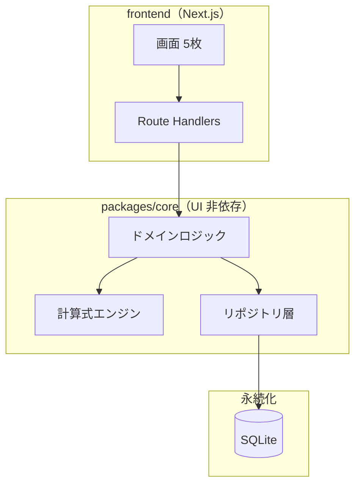
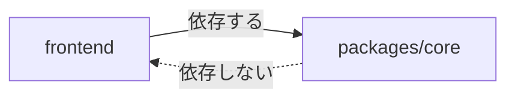
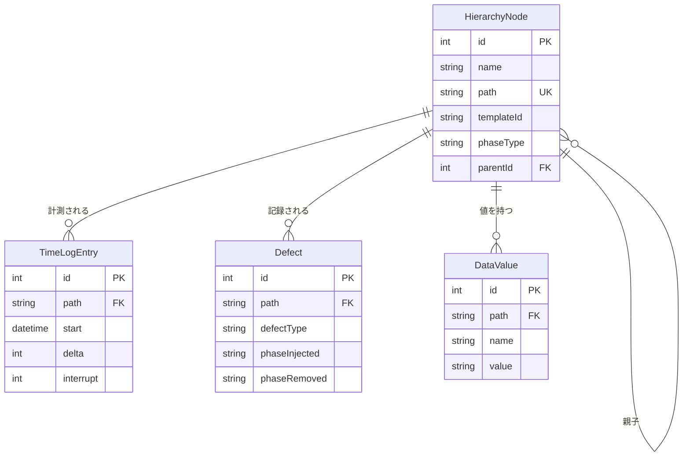
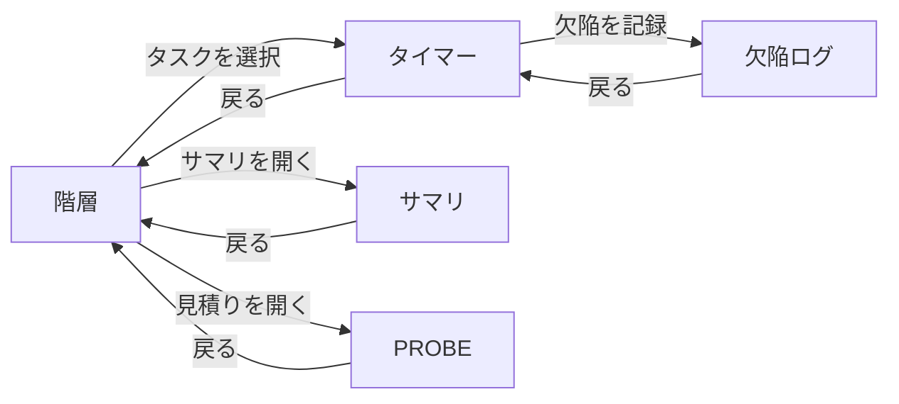

# Processloop アーキテクチャ仕様書（第1期）

移植先 Processloop を**どういう構造で作るか**を定める。

⚠️ 移植元 Process Dashboard の解析は [architecture-analysis.md](../architecture-analysis.md) にある。
本書は移植先の設計であり、両者は別の文書である。

```
https://github.com/ChestnutForest/processloop/blob/main/docs/architecture-analysis.md
```

---

## 本書の状態

**段階1（仕掛レベル相当）まで記述済み。**

工程ゲート G1 の条件は「要求仕様と ARC が承認され、TM の骨格ができている」であり、
ARC の完成を求めていない。IPA の合意成熟度でも、仕掛レベルは
一覧と共通ルールが揃った状態を指す。

段階の定義と分割の根拠は [arc-outline.md](arc-outline.md) を参照。

```
https://github.com/ChestnutForest/processloop/blob/main/docs/phase1/arc-outline.md
```

| 章 | 段階1 | 段階2 | 段階3 |
|---|---|---|---|
| 1 本書の位置づけ | ✅ | | |
| 2 全体構成 | ✅ | | |
| 3 データモデル | ✅ 一覧とER図 | 属性・スキーマ・CRUD図 | |
| 4 計算式エンジン | | | M3 着手前 |
| 5 永続化 | | ✅ | |
| 6 画面 | ✅ 一覧と遷移 | 構成の詳細 | |
| 7 API | | ✅ | |
| 8 テスト方式 | ✅ 境界の定義 | | |
| 9 横断的な方針 | | ✅ | |
| 10 決定の一覧 | ✅ ADR参照 | | |

---

## 1. 本書の位置づけ

### 1.1 目的と範囲

第1期（個人の PSP 機能 ＋ PROBE ＋ EV）を対象とする。
チーム機能と周辺ツールは対象外であり、第2期以降に別途定める。

### 1.2 上位文書との関係

```
移植元の解析 → 要求定義 → アーキテクチャ設計 → プログラム設計 → 実装
     ↑              ↑              ↑                  ↑
architecture-  FR/NFR/CON      本書（ARC）        PRT-xx（未作成）
analysis.md
```

| 文書 | 関係 |
|---|---|
| [overview.md](req/overview.md) | 目的・範囲・用語・共通ルール。本書は用語を再定義しない |
| [FR/NFR/CON](req/) | 要求仕様。本書は要求を実現する構造を定める |
| [architecture-analysis.md](../architecture-analysis.md) | 移植元の解析。本書の設計判断の根拠 |
| [ADR](../adr/) | 個別の設計決定とその経緯 |

**要件定義の概要**（用語集と共通ルール）

```
https://github.com/ChestnutForest/processloop/blob/main/docs/phase1/req/overview.md
```

**要求仕様の一覧**

```
https://github.com/ChestnutForest/processloop/blob/main/tree/main/docs/phase1/req
```

**移植元の解析報告**

```
https://github.com/ChestnutForest/processloop/blob/main/docs/architecture-analysis.md
```

**決定記録（ADR）**

```
https://github.com/ChestnutForest/processloop/blob/main/tree/main/docs/adr
```

### 1.3 用語

[overview.md](req/overview.md) の用語集に従う。**本書では再定義しない。**

---

## 2. 全体構成

### 2.1 層構成



<details>
<summary>ソースを見る</summary>

````markdown

````

</details>

### 2.2 `packages/core` を分離する理由

**根拠は移植元の構造にある。** 移植元の `data` パッケージは171ファイル中、
Swing に依存するものが1ファイルしかない（0.6%）。
ロジックと UI が既に分離されており、その構造を保つのが自然である。

実測の出典は解析報告の「UI とロジックの分離度」にある。

```
https://github.com/ChestnutForest/processloop/blob/main/docs/architecture-analysis.md
```

分離により次を得る。

| 利点 | 内容 |
|---|---|
| テストが書きやすい | UI を起動せずドメインロジックを検証できる |
| 移植の検証が容易 | ゴールデンファイルとの突き合わせが UI と無関係に行える |
| 将来の選択肢 | チーム機能で負荷が増えたら独立サーバへ切り出せる |

### 2.3 依存の方向

**`packages/core` は frontend に依存しない。** 一方向の依存とする。



<details>
<summary>ソースを見る</summary>

````markdown

````

</details>

`packages/core` に React や Next.js の import が現れたら設計違反とする。

### 2.4 モノレポ構成

pnpm workspaces を用いる。

```
processloop/
├─ packages/core/     UI 非依存のドメイン層
├─ frontend/          Next.js アプリケーション
├─ i18n/              多言語メッセージ（en / ja）
└─ scripts/           検証スクリプト
```

pnpm を選ぶ理由は、npm の巻き上げによる**幽霊依存**（package.json に宣言していない
依存を import できてしまう状態）を構造的に防ぐためである。
シンボリックリンクで正しい依存階層を表現する。

---

## 3. データモデル

### 3.1 エンティティ一覧

第1期で扱うのは4つである。

| # | エンティティ | 役割 | M1 | 移植元の対応 |
|---|---|---|---|---|
| 1 | **HierarchyNode** | プロジェクトの階層。タスクとフェーズ | ✅ | `state` ファイル（XML） |
| 2 | **TimeLogEntry** | 作業時間の記録 | ✅ | `timelog.xml` |
| 3 | **Defect** | 欠陥の記録 | M2 | `*.def` |
| 4 | **DataValue** | 計算式が扱う値 | ⚠️ M3 | `*.dat` |

⚠️ **`DataValue` は M3 で確定する。** 計算式エンジンが扱う値を保持するモデルであり、
エンジンの設計に依存する。M1 と M2 では使用しない。
段階2で属性を定義する際も、最小限にとどめて M3 で拡張する方針を採る。

移植元の永続化4系統（`state` / `timelog.xml` / `*.def` / `*.dat`）の解析は解析報告にある。

```
https://github.com/ChestnutForest/processloop/blob/main/docs/architecture-analysis.md
```

### 3.2 ER図



<details>
<summary>ソースを見る</summary>

````markdown

````

</details>

⚠️ 図の `DataValue` は M3 で確定するため、属性は暫定である。

### 3.3 パスによる結合

**移植元では全データが `path`（階層パス）で結び付いている。** この設計を引き継ぐ。

```
/MyProject/Design      ← HierarchyNode の path
```

`TimeLogEntry` `Defect` `DataValue` はいずれも `path` を持ち、対象のノードを指す。

移植先では `path` に加えて**外部キーでも結ぶ**。理由は整合性の担保である。
移植元は文字列の一致だけで結んでおり、ノード名を変えるとリンクが切れる恐れがある。

⚠️ ノード名の変更時は、配下すべてのパスを付け直す必要がある
（要求仕様 `FR-HIER-001.520`）。

```
https://github.com/ChestnutForest/processloop/blob/main/docs/phase1/req/fr-hier-001.md
```

### 3.4 計算結果を保存しない

**派生指標（歩留まり、欠陥密度、CPI、SPI）はデータベースに保存せず、都度計算する。**

移植元の `DataRepository` が、値の変更を検知して依存する値を自動再計算する
リアクティブな設計を採っているためである。計算結果を保存すると、
元データの変更時に整合を保つ責任が生じ、設計が二重になる。

保存するのは**実測値のみ**とする。

| 保存する | 保存しない |
|---|---|
| 作業時間、中断時間 | 合計時間、フェーズ別の配分 |
| 欠陥の混入・除去フェーズ | 歩留まり、欠陥密度 |
| 見積り規模、実績規模 | PROBE の回帰結果 |

---

## 4. 計算式エンジン

⚠️ **段階3（M3 着手前）で記述する。**

移植元の5層構造の解析は [architecture-analysis.md](../architecture-analysis.md) にある。
本書では M3 の直前に、移植先での層の配置と責務を定める。

M1 と M2 ではエンジンを使わない。合計時間などの単純な集計は
TypeScript で直接書き（約100行）、M3 でエンジンに置き換える。
**呼び出し側のインタフェースを変えない設計**とし、差し替えを局所化する。

---

## 5. 永続化

⚠️ **段階2で記述する。**

現時点で確定しているのは次の2点である。

- SQLite を用い、Prisma 経由で操作する
- リポジトリ層は `packages/core` に置き、frontend から直接データベースに触れない

---

## 6. 画面

### 6.1 画面一覧

| # | 画面 | 役割 | M1 |
|---|---|---|---|
| 1 | **階層** | プロジェクトの構成、プロセスの割り当て | ✅ |
| 2 | **タイマー** | 作業時間の計測、中断、記録 | ✅ |
| 3 | 欠陥ログ | 欠陥の記録と一覧 | M2 |
| 4 | PROBE | 過去データにもとづく見積り | M4 |
| 5 | サマリ | 集計、EV レポート | M1 は簡易集計のみ |

M1 の2画面に対応する要求仕様は次のとおり。

**階層の要求**（FR-HIER-001）

```
https://github.com/ChestnutForest/processloop/blob/main/docs/phase1/req/fr-hier-001.md
```

**時間ログの要求**（FR-TIME-001）

```
https://github.com/ChestnutForest/processloop/blob/main/docs/phase1/req/fr-time-001.md
```

### 6.2 画面遷移



<details>
<summary>ソースを見る</summary>

````markdown

````

</details>

⚠️ **画面遷移図は暫定的に本書に置く。** 遷移は画面間の関係でありアーキテクチャの
一部と解釈できるためである。画面仕様書（SCR）を書く段階で、重複が生じるようなら見直す。

図の記法は作図ガイドに従う。

```
https://github.com/ChestnutForest/processloop/blob/main/docs/phase1/req/diagram-guide.md
```

### 6.3 画面レイアウトを実装に委ねる

**第1期では画面レイアウトの設計書を作らない。実装そのものを正とする。**

理由は2つある。第1期の画面は5つと少なく二重管理の労力が見合わないこと、
そして発注者が存在せず実装前にレイアウトを合意する相手がいないことである。

⚠️ 第2期でチーム利用に広がった時点で再検討する。

### 6.4 構成の詳細

⚠️ **段階2で記述する。** Next.js の App Router、状態管理、next-intl の構成を扱う。

---

## 7. API

⚠️ **段階2で記述する。**

現時点で確定しているのは、**別サーバを建てず Next.js の Route Handlers に統合する**ことである。
根拠は `packages/core` が UI 非依存であり、実行の場所を選ばないためである。

API の入出力は OpenAPI（YAML）で `docs/phase1/api/openapi.yaml` に別管理する。

---

## 8. テスト方式

### 8.1 単体・結合・総合の境界

| 種別 | 対象 | 判定 | ツール |
|---|---|---|---|
| **単体テスト** | 1つのユニット内の関数・クラス | 入力に対する出力が期待どおりか | Vitest |
| **結合テスト** | **コンポーネント間のインタフェース** | 層をまたいだ呼び出しが成立するか | Vitest |
| **総合テスト** | **ユーザーマニュアルに沿った操作** | 利用者の目的が達成できるか | Playwright |

**結合テストの具体的な境界**を定める。

| # | 結合の対象 | 時期 |
|---|---|---|
| IT-01 | リポジトリ層 ↔ SQLite | M1 |
| IT-02 | ドメインロジック ↔ リポジトリ層 | M1 |
| IT-03 | Route Handlers ↔ ドメインロジック | M1 |
| IT-04 | 計算式エンジンの5層の連結 | M3 |
| IT-05 | 計算式エンジン ↔ ドメインロジック | M3 |

### 8.2 ゴールデンファイルの位置づけ

**移植元を実行して得た出力を正解データとする。** 移植元の `data` パッケージには
テストが1件も存在しないため、参照できるテストがない。

ゴールデンファイルは**単体テストの一部**として扱う。
配置は各ユニットの `__fixtures__/` とする。

生成手順は移植元の参照資料の README にある。

```
https://github.com/ChestnutForest/processloop/blob/main/reference/legacy-java/README.md
```

### 8.3 使用するツール

| 用途 | ツール |
|---|---|
| 単体・結合テスト | Vitest |
| 総合テスト（E2E） | Playwright |
| 型検査 | TypeScript（strict ＋ `noUncheckedIndexedAccess`） |
| Mermaid の構文検証 | `scripts/validate-mermaid.mjs` |

⚠️ Playwright MCP の採用可否は未決である。**再現可能なテストコードとして残す**ことが
目的であるため、通常の Playwright を基本とし、MCP は開発中の対話的な確認に
補助的に使う位置づけを想定する。

### 8.4 検証スクリプト

| 対象 | スクリプト | 状態 |
|---|---|---|
| Mermaid の構文 | `scripts/validate-mermaid.mjs` | ✅ 実装済み |
| 要求仕様の Front Matter | `scripts/validate-requirements.mjs` | ⬜ 未実装 |

Front Matter の検証では、JSON Schema への適合、ID の重複、
参照先の存在、`spec_count` と実数の一致を検査する。

**Mermaid の検証スクリプト**

```
https://github.com/ChestnutForest/processloop/blob/main/scripts/validate-mermaid.mjs
```

**Front Matter の JSON Schema**

```
https://github.com/ChestnutForest/processloop/blob/main/docs/phase1/req/_schema/requirement.schema.json
```

---

## 9. 横断的な方針

⚠️ **段階2で記述する。**

エラー処理、文字コード、時刻の扱い、ライセンス順守を扱う。

⚠️ 文字コードと時刻の**規約自体は [overview.md](req/overview.md) の共通ルールに定めている**。
本書では規約を再掲せず、**実装でどう担保するか**を書く。

---

## 10. 決定の一覧

### 10.1 ADR への参照

| ADR | 決定 | 本書への影響 |
|---|---|---|
| [ADR-0001](../adr/adr-0001-data-collection-first.md) | 実装順序をデータ収集先行にする | 第3章の M1 対象、第4章の後回し |
| [ADR-0002](../adr/adr-0002-measurement-recording.md) | 手動記録を行わない | 直接の影響なし |
| [ADR-0003](../adr/adr-0003-diagram-notation.md) | 作図記法を Mermaid に統一 | 本書の図の記法 |

**ADR-0001 実装順序**

```
https://github.com/ChestnutForest/processloop/blob/main/docs/adr/adr-0001-data-collection-first.md
```

**ADR-0002 計測データの記録方式**

```
https://github.com/ChestnutForest/processloop/blob/main/docs/adr/adr-0002-measurement-recording.md
```

**ADR-0003 作図記法**

```
https://github.com/ChestnutForest/processloop/blob/main/docs/adr/adr-0003-diagram-notation.md
```

### 10.2 ADR に至らない設計判断

判断の経緯が長いものは ADR に切り出し、本書からは参照する。
本書に直接記録するのは、経緯が短く説明の付くものに限る。

| 判断 | 記載箇所 |
|---|---|
| `packages/core` を分離する | 2.2 |
| 依存を frontend → core の一方向にする | 2.3 |
| pnpm workspaces を用いる | 2.4 |
| パスに加えて外部キーでも結ぶ | 3.3 |
| 計算結果を保存しない | 3.4 |
| 画面レイアウトを実装に委ねる | 6.3 |
| Route Handlers に統合する | 第7章 |

---

## 未記述の章

段階2と段階3で記述する。

| 章 | 段階 | 着手の時期 |
|---|---|---|
| 3.4 以降の属性定義、Prisma スキーマ、CRUD図 | 2 | M1 着手前 |
| 第5章 永続化 | 2 | M1 着手前 |
| 6.4 構成の詳細 | 2 | M1 着手前 |
| 第7章 API | 2 | M1 着手前 |
| 第9章 横断的な方針 | 2 | M1 着手前 |
| 第4章 計算式エンジン | 3 | M3 着手前 |
