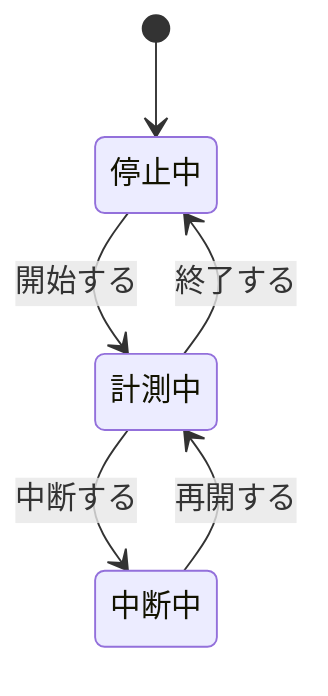

# 要求仕様の記述形式 — USDM を Markdown + YAML Front Matter で書く

Processloop の要求仕様は **USDM**（Universal Specification Describing Manner）で記述する。
USDM は清水吉男氏が提唱した記法で、要求と仕様を階層構造の中で1つの文書にまとめ、
要求には必ず理由を添えることを求める。

出典: 派生開発推進協議会 AFFORDD T2 研究会「USDM 小冊子 基礎編 ver 1.3」（2016）

一次情報の URL は [references.md](../../references.md) に集約している。

本書は、Excel 表を前提とする USDM の様式を **Markdown + YAML Front Matter** に写す方法を定める。

本書は **IPA「機能要件の合意形成ガイド」（2010）との統合を反映済み**である。
同ガイドが定める6技術領域を網羅性の軸として取り込んでいる。
統合の設計と決定の経緯は [ipa-integration-proposal.md](ipa-integration-proposal.md) を参照。

---

## 1. なぜ Markdown + YAML Front Matter か

| 観点 | Excel | Markdown + YAML |
|---|---|---|
| 差分の追跡 | バイナリのため困難 | **行単位で追える** |
| レビュー | ファイル全体の受け渡し | **Pull Request で差分レビュー** |
| 機械処理 | 専用ライブラリが必要 | **YAML をそのまま読める** |
| 図の埋め込み | 画像として貼る | **Mermaid でテキスト化** |
| 人間の可読性 | 表として見やすい | 本文として読みやすい |

USDM の本質は表形式ではなく、**要求・理由・説明・仕様グループ・仕様という構造**にある。
この構造は Markdown の見出しで表現できる。

---

## 2. ファイルの構成

```
docs/phase1/req/
├─ README.md                    本書
├─ overview.md                  概要編に相当（目的・範囲・用語・要求一覧）
├─ review-checklist.md          レビュー観点30項目
├─ diagram-guide.md             図表の書き方（工程成果物ごと）
├─ ipa-integration-proposal.md  IPA ガイド統合の設計と経緯
├─ _template.md                 新規作成時の雛形
├─ _schema/
│   └─ requirement.schema.json  Front Matter の検証スキーマ
├─ fr-hier-001.md               機能要求
├─ fr-time-001.md
├─ nfr-i18n-001.md              非機能要求
└─ con-license-001.md           制約
```

**1要求 = 1ファイル**とする。要求を分割して階層化した場合、下位要求も独立したファイルにし、
`parent` と `children` で関係を表す。

---

## 3. ID の体系

### 接頭辞

| 接頭辞 | 種別 | 例 |
|---|---|---|
| `FR-` | 機能要求（Functional Requirement） | `FR-TIME-001` |
| `NFR-` | 非機能要求（Non-Functional Requirement） | `NFR-I18N-001` |
| `CON-` | 制約（Constraint） | `CON-LICENSE-001` |

### 構造

```
FR - TIME - 001
│    │      └─ 連番（3桁）
│    └─ カテゴリ略号（USDM のカテゴリ名に対応）
└─ 種別
```

### 仕様 ID

USDM では要求 ID の配下に仕様 ID を振る。要求 ID にドットと2桁を付す。

```
FR-TIME-001.10    仕様グループ1の1件目
FR-TIME-001.20    仕様グループ1の2件目
FR-TIME-001.110   仕様グループ2の1件目
```

**10 刻み**にするのは、後から仕様を挿入できるようにするためである。
仕様グループが変わるところで百の位を繰り上げる。

### カテゴリ略号（第1期）

| 略号 | カテゴリ | 対応する移植ユニット |
|---|---|---|
| `HIER` | プロジェクト階層 | B-2 |
| `PROC` | プロセス定義 | B-3 |
| `TIME` | 時間ログ | B-4 |
| `DEF` | 欠陥ログ | B-5 |
| `PROBE` | PROBE 見積り | B-6 |
| `EV` | 出来高管理 | B-7, B-8 |
| `CALC` | 計算式エンジン | A-1 〜 A-7 |
| `I18N` | 多言語対応 | — |
| `LICENSE` | ライセンス順守 | — |

---

## 4. Front Matter の項目

```yaml
---
schema_version: 1
id: FR-TIME-001
category: TIME
category_name: 時間ログ
title: 作業時間を計測して時間ログに記録する
type: functional
priority: must
status: draft
parent: null
children: []
unit: B-4
spec_count: 12
source:
  upstream_sha: bf5a4d63aff08410f79840001c816b37392e5001
  files:
    - src/net/sourceforge/processdash/log/time/TimeLogIOConstants.java
  analysis_refs:
    - ANA-B4
depends_on:
  - FR-HIER-001
test_refs:
  - UT-B4
  - IT-01
---
```

| 項目 | 必須 | 内容 |
|---|---|---|
| `schema_version` | ✅ | スキーマの版。現在は 1 |
| `id` | ✅ | 要求 ID。全ファイルで一意 |
| `category` | ✅ | カテゴリ略号 |
| `category_name` | ✅ | カテゴリの日本語名 |
| `title` | ✅ | 要求の要約。**動詞形で終える** |
| `type` | ✅ | `functional` / `non_functional` / `constraint` |
| `priority` | ✅ | `must` / `should` / `could` / `wont` |
| `status` | ✅ | `draft` / `reviewed` / `approved` / `obsolete`（下記の合意成熟度に対応） |
| `domains` | ✅ | IPA の6技術領域のうち本要求が触れるもの。該当なしは `[none]` |
| `parent` | ✅ | 上位要求の ID。最上位なら `null` |
| `children` | ✅ | 下位要求の ID の配列。無ければ空配列 |
| `unit` | ✅ | 対応する移植ユニット（A-1 〜 C） |
| `spec_count` | ✅ | 本文に含まれる仕様の数 |
| `source` | ✅ | **移植元の根拠**（下記） |
| `depends_on` | | 依存する他の要求の ID |
| `test_refs` | | 対応するテストの ID |

### `domains` と `status` — IPA ガイドとの接続

`domains` は、IPA ガイドが定める6技術領域のうち本要求が触れるものを宣言する。
USDM の仕様グループが**要求の動詞**から立つ縦の構造であるのに対し、
`domains` は**記述漏れを検出する横の軸**として働く。

```yaml
domains:
  - behavior      # システム振舞い
  - screen        # 画面
  - data_model    # データモデル
  # external_if / batch / report / none
```

`status` は同ガイドの合意成熟度に対応する。

| `status` | 合意成熟度 | 判定基準 |
|---|---|---|
| `draft` | 仕掛レベル | 要求の範囲と目的が書けた |
| `reviewed` | 充実レベル | 仕様と図表が揃い、レビューを一巡した |
| `approved` | 完成レベル | 抜けと曖昧さが解消し、実装に引き渡せる |

移行時のチェックは [review-checklist.md](review-checklist.md) を使う。

### ★ `source` — 移植プロジェクト固有の項目

新規開発では要求の源泉は依頼者にあるが、**移植では移植元の挙動が要求の源泉**になる。
そこで、根拠となるファイルと上流のコミット SHA を Front Matter に持たせる。

```yaml
source:
  upstream_sha: bf5a4d63aff08410f79840001c816b37392e5001
  files:
    - src/net/sourceforge/processdash/log/time/TimeLogIOConstants.java
  analysis_refs:
    - ANA-B4
```

これにより、要求から移植元のコードまで機械的に辿れる。
トレーサビリティマトリクスの「移植元の根拠」列は、この項目から生成できる。

### ★ `spec_count` — 生産性の計測に使う

USDM は、仕様数と作業時間を記録することで生産性を把握し、
以降の工数見積りに使えるとしている。

Processloop では [ADR-0001](../../adr/adr-0001-data-collection-first.md) により
この開発自体を PSP で計測するため、**仕様数は行数と並ぶ規模の代理指標**になる。
PROBE の入力として使える可能性がある。

---

## 5. 本文の構成

```markdown
# FR-TIME-001 作業時間を計測して時間ログに記録する

## 要求

（振る舞いを動詞形で記述する）

## 理由

（なぜこの要求が必要か）

## 説明

（補足。データ範囲、前提、移植元との差異など）

## 仕様

### <仕様グループ名>

- [ ] **FR-TIME-001.10** 仕様の記述
- [ ] **FR-TIME-001.20** 仕様の記述

### <別の仕様グループ名>

- [ ] **FR-TIME-001.110** 仕様の記述

## 関連資料
```

### 「要求」の書き方

USDM は要求に3つの役割を課している。

**1. ソフトウェアの振る舞いを見せ、動きを感じさせる**

「表示」ではなく「**表示する**」と動詞形で書く。名詞形では動きが伝わらない。

**2. 求められている範囲を示す**

イベントに始まり、入力処理 → 変換処理 → 出力処理を経て止まるまでを1つの要求に収める。
データの上限・下限、正常値と異常値の基準も範囲に含まれる。

**3. 全ての動詞と目的語を見せる**

「〜を〜して、〜を〜して、〜を〜する。」という形で、目的語と動詞を交互に連ねる。
ここに書かれた動詞が、そのまま仕様グループになる。

**動詞が8個以上になったら要求を分割する。** 分割の型は4つある。

| 型 | 分割の観点 |
|---|---|
| 時系列分割 | 時間軸で区切る |
| 構成分割 | 機能別・構成別で区切る |
| 状態分割 | 状態の概念で区切る |
| 共通分割 | 共通する処理を独立させる |

分割したら、上位要求と下位要求をそれぞれ別ファイルにし、`parent` / `children` で結ぶ。
**下位要求にも理由を書く。**

### 「理由」の書き方

要求が生じた背景を書く。「業務を効率化するため」のような一般論では理由にならない。
**その要求に特有の理由**を書く。

移植プロジェクトでは、次の観点が理由になりやすい。

- 移植元がその挙動を持つ根拠（PSP の方法論上の必然性など）
- 既存データとの互換性
- この開発自体を PSP で計測するという方針（ADR-0001）

### 「説明」の書き方

要求の補足を書く。移植では次を書くとよい。

- 移植元との差異と、その判断理由
- 移植しない部分と、その理由
- データの範囲（上限・下限・異常値）

### 「仕様」の書き方

要求に含まれる**動詞と目的語のペアごとに仕様グループ**を立て、その配下に仕様を書く。

仕様は次の3条件を満たす粒度にする。

- 要求から導出される（全ての仕様が要求の範囲に収まる）
- 設計をイメージできる（作業と時間が見積もれる）
- 検証をイメージできる（テスト手段が導出できる）

チェックボックス `- [ ]` を付けるのは、USDM の様式が仕様チェックボックスを持つためである。
実装が完了した仕様は `- [x]` にする。**要求仕様書がそのままチェックリストになる。**

---

## 6. 避けるべき表現

USDM が指摘する3つを守る。

### 「等」「etc」を使わない

現時点で確定できることは全て書く。未確定なら、**合意する時期を明記する**。

```markdown
❌ - [ ] FR-TIME-001.10 開始時刻、経過時間等を記録する。
✅ - [ ] FR-TIME-001.10 開始時刻、経過時間、中断時間、コメントを記録する。
```

### 否定表現に注意する

「〜しない」という表現の裏には、書かれていない条件分岐が隠れている。
「もし〜の場合は」と書いたら、**else は何か**を必ず考える。

```markdown
❌ - [ ] 中断中は経過時間を加算しない。
✅ - [ ] 中断中は経過時間を加算せず、中断時間に加算する。
✅ - [ ] 中断が解除されたら、経過時間の加算を再開する。
```

### ペースト作文を避ける

一部だけ違う仕様をコピーして書くと、差異が読み取れなくなる。
条件が複数あるなら、**表やディシジョンテーブルで整理する**。

---

## 7. 図の埋め込み

作図記法は **Mermaid に統一**する（[ADR-0003](../../adr/adr-0003-diagram-notation.md)）。
GitHub 上でそのまま描画される。



<details>
<summary>ソースを見る</summary>

````markdown

````

</details>

**一覧・定義・対応表は図にせず Markdown 表で書く。** 機械的な検査がしやすく、差分も読める。

工程成果物ごとの具体的な書き方は [diagram-guide.md](diagram-guide.md) を参照。

**図は仕様の代わりにならない。** 仕様は文章で書き、図は理解を助けるために添える。

⚠️ 図が読みにくくなったら、図を大きくするのではなく**要求を分割する合図**と受け取る。
USDM が動詞8個以上で分割せよと定めるのと、判断基準が一致する。

## 8. API 仕様の分離

Route Handlers の入出力は **OpenAPI（YAML）** として別ファイルに分ける。

```
docs/phase1/api/openapi.yaml
```

要求仕様からは相対パスで参照する。

```markdown
## 関連資料
- API 仕様: `../api/openapi.yaml#/paths/~1api~1time-log`
```

理由は2つある。API 定義は機械可読な標準形式で持つ方が検証やコード生成に使えること、
そして要求仕様に埋め込むと、要求の変更と API の変更が区別できなくなることである。

---

## 9. Front Matter の検証

`_schema/requirement.schema.json` で JSON Schema による検証を行う。

```bash
pnpm add -D ajv ajv-cli js-yaml
```

検証スクリプトの例。

```javascript
// scripts/validate-requirements.mjs
import { readFileSync, readdirSync } from 'node:fs';
import { join } from 'node:path';
import matter from 'gray-matter';
import Ajv from 'ajv';

const schema = JSON.parse(readFileSync('docs/phase1/req/_schema/requirement.schema.json', 'utf-8'));
const ajv = new Ajv({ allErrors: true });
const validate = ajv.compile(schema);

const dir = 'docs/phase1/req';
const ids = new Set();
let failed = false;

for (const file of readdirSync(dir).filter(f => f.endsWith('.md') && !f.startsWith('_') && f !== 'README.md')) {
  const { data } = matter(readFileSync(join(dir, file), 'utf-8'));
  if (!validate(data)) {
    console.error(`✗ ${file}`, validate.errors);
    failed = true;
  }
  if (ids.has(data.id)) {
    console.error(`✗ ${file}: ID が重複 ${data.id}`);
    failed = true;
  }
  ids.add(data.id);
}
process.exit(failed ? 1 : 0);
```

`package.json` に登録する。

```json
"scripts": {
  "validate:req": "node scripts/validate-requirements.mjs"
}
```

**ID の重複と、参照先の存在**も併せて検証する。
`parent` や `depends_on` が実在しない ID を指していたら失敗させる。

---

## 10. トレーサビリティとの接続

[deliverables-proposal.md](../../deliverables-proposal.md) で定めた工程 ID と接続する。

```
ANA-B4（解析）
  ↓ source.analysis_refs
FR-TIME-001（要求）
  ↓ unit
PRT-B4（移植仕様＝プログラム設計）
  ↓
SRC-B4（実装）
  ↓ test_refs
UT-B4 / IT-01 / ST-xx（テスト）
```

Front Matter から機械的に抽出できるため、**トレーサビリティマトリクスは自動生成できる**。

要求仕様は単一の文書ではなく1要求1ファイルとなるため、
[deliverables-proposal.md](../../deliverables-proposal.md) の文書構成も本形式に合わせて更新済みである。

要求を受けた設計は [arc-architecture.md](../arc-architecture.md) に定める。

```
https://github.com/ChestnutForest/processloop/blob/main/docs/phase1/arc-architecture.md
```

---

## 11. 作成の手順

1. `_template.md` を複製し、ID を付けたファイル名にする
2. Front Matter を埋める（`spec_count` は最後に数える）
3. **要求**を振る舞いで書く。動詞を数え、8個以上なら分割する
4. **理由**を書く。一般論ではなく、その要求に特有の理由を書く
5. 要求に含まれる動詞ごとに**仕様グループ**を立てる
6. 各グループの配下に**仕様**を書く。「等」「否定表現」「ペースト作文」を避ける
7. `pnpm validate:req` で検証する

USDM は、要求の引き出しと仕様化を明確に分けることを推奨している。
手順3〜5までを「要求の引き出し」、手順6を「仕様化」として、日を分けて行うとよい。
