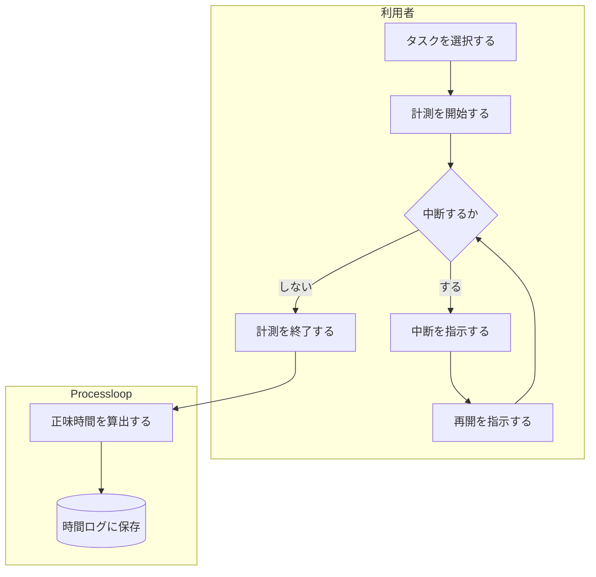
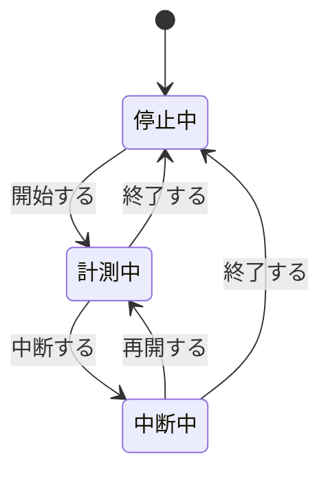
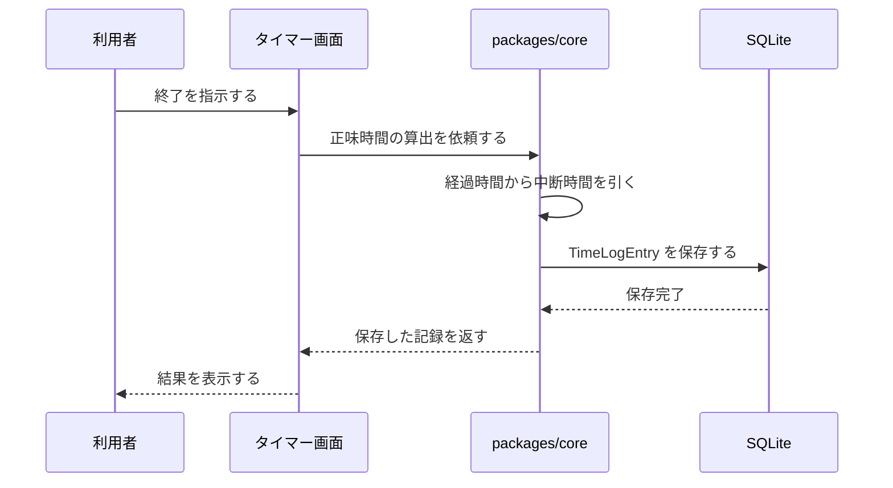
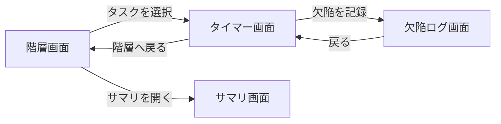
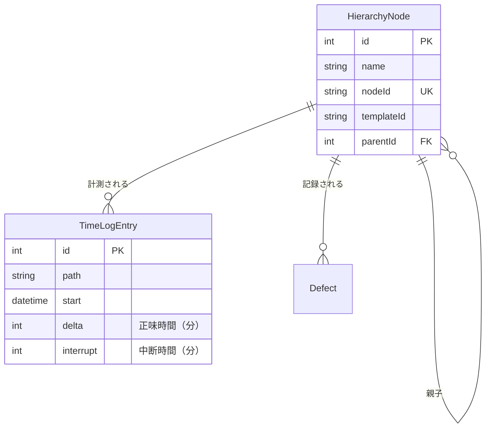
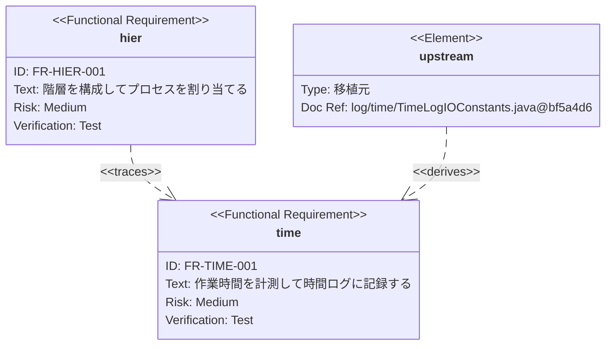

# 図表の書き方 — 工程成果物ごとの記法

IPA「機能要件の合意形成ガイド」が技術領域ごとに想定する「工程成果物」を、
Processloop でどう書くかを定める。記法の選定理由は
[ADR-0003](../../adr/adr-0003-diagram-notation.md) を参照。

## この文書の読み方

各図は**描画された状態**で示し、その下の「ソースを見る」を開くと**書き方**が確認できる。
GitHub 上では Mermaid のコードブロックがそのまま図として描画されるため、
上段が実際の表示、下段が同じ内容のソースになる。

---

## 記法の割り当て

| 工程成果物の性質 | 記法 |
|---|---|
| 関係・流れ・状態を表すもの | **Mermaid** |
| 一覧・定義・対応表 | **Markdown 表** |
| API の入出力 | **OpenAPI（YAML）** |
| 画面の見た目 | **実装を正とする**（第1期） |

⚠️ **図で書けるからといって図にしない。** 一覧は表のほうが機械的に検査でき、
差分も読みやすい。IPA の工程成果物のうち「〜一覧」「〜項目説明」「CRUD図」は
いずれも表形式が適する。

---

## システム振舞い

### システム化業務フロー

`flowchart` で書く。担当者や部門で区分する場合は `subgraph` を使う。



<details>
<summary>ソースを見る</summary>

````markdown

````

</details>

⚠️ Mermaid には Swimlanes Diagram も追加されているが、
GitHub の描画環境が対応しているか未検証である。**確認できるまで `subgraph` を使う。**

### 状態遷移

`stateDiagram-v2` で書く。IPA の工程成果物には状態遷移図が明示されていないが、
「保持する情報とその状態遷移」を外部設計で明確にすべき事項として挙げている。



<details>
<summary>ソースを見る</summary>

````markdown

````

</details>

**すべての状態から、すべての遷移を書く。** 書かれていない遷移は「起こらない」と読まれる。

### 処理の順序

`sequenceDiagram` で書く。複数の層をまたぐ処理に使う。



<details>
<summary>ソースを見る</summary>

````markdown

````

</details>

### システム化業務一覧

**Markdown 表**で書く。

```markdown
| # | 業務 | 機能 | 対応する要求 |
|---|---|---|---|
| 1 | 作業計測 | 時間の計測と記録 | FR-TIME-001 |
| 2 | 作業計測 | 中断の記録 | FR-TIME-001 |
```

---

## 画面

### 画面遷移

`flowchart` で書く。遷移のきっかけとなる操作をラベルに書く。



<details>
<summary>ソースを見る</summary>

````markdown

````

</details>

### 画面一覧・画面入出力項目一覧

**Markdown 表**で書く。桁数と型を含める。

```markdown
| # | 項目 | 種別 | 入出力 | 型 | 桁 | i18n キー |
|---|---|---|---|---|---|---|
| 1 | 経過時間 | ラベル | 出力 | 文字列 | 8 | `timer.elapsed` |
| 2 | コメント | テキスト | 入力 | 文字列 | 1000 | `timer.comment` |
```

**i18n キーの列を設けるのが Processloop 固有の点である。**
多言語対応が要件であるため、画面項目とメッセージキーの対応を要求仕様の段階で決める。

### 画面レイアウト

**第1期では書かない。実装を正とする。**

理由は2つある。第1期の画面は5つと少なく、二重管理の労力が見合わないこと。
そして発注者が存在せず、実装前にレイアウトを合意する相手がいないことである。

⚠️ 第2期でチーム利用に広がった時点で再検討する。

---

## データモデル

### ER図

`erDiagram` で書く。



<details>
<summary>ソースを見る</summary>

````markdown

````

</details>

### エンティティ定義

**Markdown 表**で書く。範囲（上限・下限・異常値）を含める。

```markdown
| # | 属性 | 型 | 桁 | PK | 範囲 | 説明 |
|---|---|---|---|---|---|---|
| 1 | delta | Int | — | | 0 以上 | 中断を除いた正味時間（分） |
| 2 | interrupt | Int | — | | 0 以上 delta 以下 | 中断時間（分） |
```

### CRUD図

**Markdown 表**で書く。行に機能、列にエンティティを置く。

```markdown
| 機能 | HierarchyNode | TimeLogEntry | Defect |
|---|---|---|---|
| 階層を作る | C | | |
| 時間を計測する | R | C | |
| 欠陥を記録する | R | | C |
| サマリを表示する | R | R | R |
```

---

## 要求間の関係

`requirementDiagram` で書く。**Front Matter から自動生成する。**

Mermaid の Requirement Diagram は SysML v1.6 の仕様に従い、
関係型が Processloop の Front Matter とほぼ1対1で対応する。

| Mermaid の関係型 | Front Matter |
|---|---|
| `contains` | `parent` / `children` |
| `derives` | `source` |
| `satisfies` | `unit` |
| `verifies` | `test_refs` |
| `traces` | `depends_on` |



<details>
<summary>ソースを見る</summary>

````markdown

````

</details>

**`risk` は Low / Medium / High、`verifymethod` は Analysis / Inspection / Test / Demonstration**
から選ぶ。SysML の列挙値であり、任意の文字列は使えない。

⚠️ **`id` と `text` は引用符で囲む。** 引用符なしだと `FR-HIER-001` のハイフンを
パーサが解釈できず、`Expecting 'NEWLINE', got 'LINE'` で構文エラーになる
（Mermaid 11.16 で確認）。`docref` や `type` も同様に囲むのが安全である。

⚠️ 手で維持するとずれるため、`overview.md` の要求一覧は
Front Matter から生成するスクリプトを用意する（未実装）。

---

## 外部インタフェース

第1期では Route Handlers（内部 API）のみが該当する。

**OpenAPI（YAML）**で `docs/phase1/api/openapi.yaml` に書き、要求仕様からは相対パスで参照する。

図が必要な場合は `sequenceDiagram` で通信の順序を表す。

---

## バッチ・帳票

**第1期では該当しない。** `domains` に `batch` `report` を宣言する要求は存在しない。

第1.5期以降にエクスポートや印刷が加わった時点で、本書に追記する。

---

## 共通の注意

### 図が読みにくくなったら、図ではなく要求を分割する

Mermaid は要素数が増えると線の交差や横長化が起きやすい。
図を大きくするのではなく、**要求を分割する合図**と受け取る。

USDM も動詞が8個以上になったら要求を分割せよと定めており、判断基準が一致する。

### 図は仕様の代わりにならない

仕様は文章で書き、図は理解を助けるために添える。
図だけを見て実装できる状態を目指すと、図が肥大化して保守できなくなる。

### 描画の確認

構文は機械的に検証できる。`scripts/validate-mermaid.mjs` がリポジトリ内の
全 Markdown から Mermaid ブロックを抽出し、パーサにかける。

```bash
pnpm add -D mermaid jsdom
pnpm validate:mermaid
```

```
  OK   flowchart            docs/phase1/req/diagram-guide.md:36
  FAIL requirementDiagram   docs/adr/adr-0003-diagram-notation.md:84
       Parse error on line 4:
```

エラーがあれば終了コード1を返すため、CI に組み込める。

⚠️ **ただし構文が通ることと、GitHub が描画することは別である。**
記法によっては GitHub 側の Mermaid バージョンが対応していない場合がある。
新しい記法を使うときは、コミット後に実際の表示も確認する。

### ★ 4連バッククォートで囲むと描画されない

Mermaid の書き方を「説明」するために4連バッククォート（````）で囲むと、
GitHub はそれをコード例として表示し、**中身を描画しない**。

本書では各図を2段構成にしている。上段は3連バッククォートで直接記述して描画させ、
下段は `<details>` に畳んだソースを置く。

検証スクリプトも同じ判定で、4連で囲まれた範囲を除外している。
