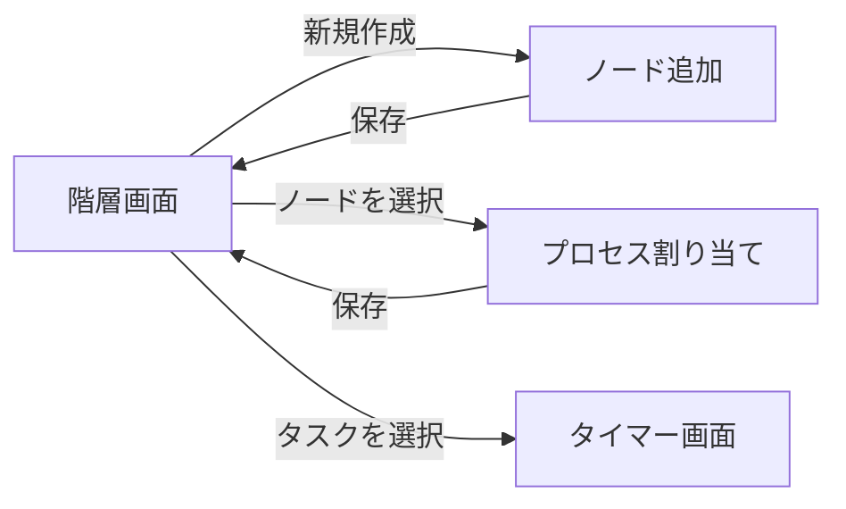
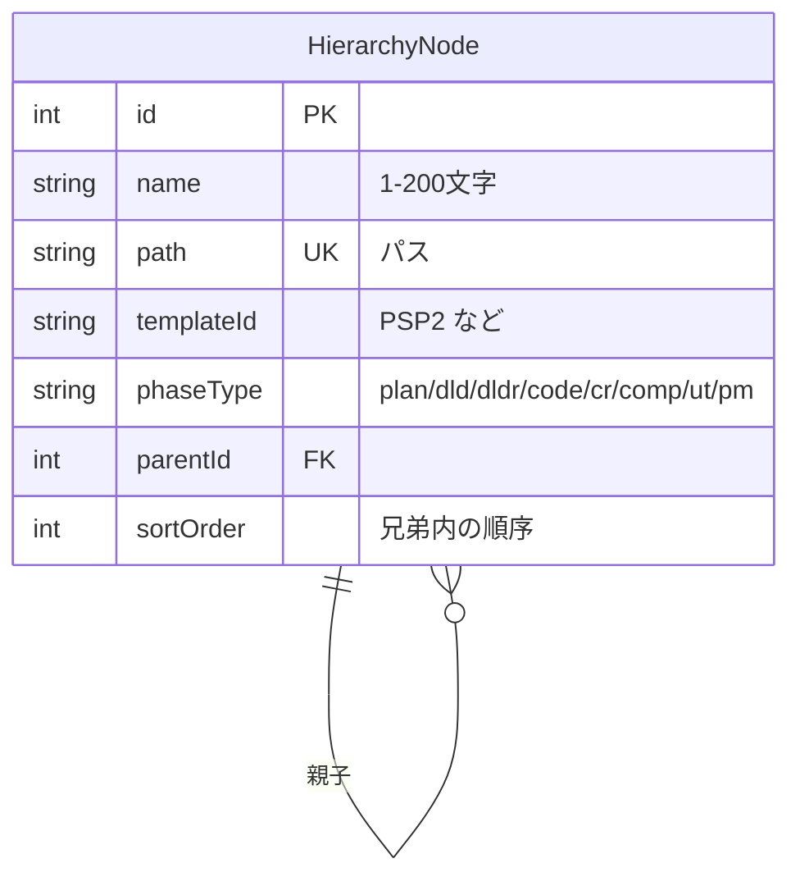

# FR-HIER-001 階層を構成してプロセスを割り当てる

## 要求

利用者がプロジェクトの名前を入力して階層の最上位を作成すると、その配下に子ノードを追加でき、
ノードにプロセス定義を割り当てると、そのプロセスが持つフェーズを子ノードとして展開し、
各ノードにパスを付与して、階層構造を保存する。

<!-- 動詞: 入力する / 作成する / 追加する / 割り当てる / 展開する / 付与する / 保存する = 7個 -->

## 理由

PSP は作業をフェーズ単位で計測することを前提とする。
どのフェーズにどれだけ時間を使ったかが分からなければ、工程ごとの工数配分も、
欠陥がどの工程で混入したかの分析もできない。

したがって計測を始める前に、**計測の対象となるフェーズが階層として存在している**必要がある。
本要求は時間ログ（FR-TIME-001）と欠陥ログの前提になる。

移植元が階層のノードに `templateID` を持たせ、プロセス定義を参照させているのは、
同じタスクでも適用するプロセス（PSP0 から PSP3）によってフェーズ構成が変わるためである。
PSP は段階的に工程を増やして学ぶ方法論であり、この可変性が方法論上の必然になっている。

## 説明

### 移植元との差異

| 項目 | 移植元 | 移植先 | 判断 |
|---|---|---|---|
| 保存先 | `state` ファイル（XML の `<node>` 入れ子） | SQLite の `HierarchyNode` テーブル | 検索と集計のため |
| データファイルの割り当て | ノードごとに `0.dat` `1.dat` と連番で対応付け | **移植しない** | 計算式の保存はエンジン導入時（M3）に設計する |
| `imaginary` 属性 | 上位プロセスでのみ有効なフェーズを表す | 第1期では**扱わない** | PSP0 から PSP3 の切り替えは第1.5期以降 |
| `constraints` 属性 | フェーズの順序制約 | 第1期では**扱わない** | 順序の強制は運用で足りる |

### M1 で扱うプロセス定義の範囲

第1期の M1 では **PSP2 の1種類のみ**を対象とする。

理由は、M1 の目的が「自分の作業時間を記録できる」ことであり、
プロセスの切り替えは後から追加できるためである。
PSP0 から PSP3 への対応は M3（計算エンジン）以降に扱う。

⚠️ ただし**データモデルは複数のプロセス定義を保持できる形にする**。
後から作り直さないためである。

### PSP2 のフェーズ構成

`PSP-template.xml` から読み取る。フェーズ種別は評価と失敗の分類に用いる。

| # | フェーズ | 種別 | 分類 |
|---|---|---|---|
| 1 | Planning | `plan` | — |
| 2 | Design | `dld` | — |
| 3 | Design Review | `dldr` | **評価** |
| 4 | Code | `code` | — |
| 5 | Code Review | `cr` | **評価** |
| 6 | Compile | `comp` | **失敗** |
| 7 | Test | `ut` | **失敗** |
| 8 | Postmortem | `pm` | — |

分類は `PhaseUtil.java` の定義に従う。M1 では分類を保持するだけで、
これを用いた集計（歩留まりなど）は M3 以降に扱う。

### データの範囲

| 項目 | 範囲 |
|---|---|
| ノード名 | 1〜200文字。同一の親の下で重複を許さない |
| パス | 先頭が `/`。区切りは `/`。1000文字以内 |
| 階層の深さ | 10段まで |
| 兄弟ノードの数 | 制限しない |

### 状態遷移

ノードは削除されるまで存在し続ける。状態を持たないため状態遷移図は設けない。

### 画面遷移



<details>
<summary>ソースを見る</summary>

````markdown

````

</details>

### データモデル



<details>
<summary>ソースを見る</summary>

````markdown

````

</details>

## 仕様

### <プロジェクト名の入力>

- [ ] **FR-HIER-001.10** ノード名として1文字以上200文字以下の文字列を受け付ける。
- [ ] **FR-HIER-001.20** 同一の親の下に同じ名前のノードが既に存在する場合、保存せずエラーを表示する。
- [ ] **FR-HIER-001.30** ノード名の前後の空白を取り除いてから保存する。

### <階層の最上位の作成>

- [ ] **FR-HIER-001.110** 親を持たないノードを最上位として作成する。
- [ ] **FR-HIER-001.120** 最上位のノードは複数作成できる。

### <子ノードの追加>

- [ ] **FR-HIER-001.210** 選択したノードの配下に子ノードを追加する。
- [ ] **FR-HIER-001.220** 階層の深さが10段に達しているノードには子ノードを追加させない。
- [ ] **FR-HIER-001.230** 追加した子ノードを、同じ親を持つ既存の子ノードの末尾に並べる。

### <プロセス定義の割り当て>

- [ ] **FR-HIER-001.310** `PSP-template.xml` から読み取ったプロセス定義の一覧を、割り当ての候補として表示する。
- [ ] **FR-HIER-001.320** 選択したプロセス定義の識別子を、対象ノードの `templateId` として保存する。
- [ ] **FR-HIER-001.330** 既にプロセス定義が割り当てられているノードに別の定義を割り当てた場合、既存のフェーズを削除してから新しいフェーズを展開する。
- [ ] **FR-HIER-001.340** 削除対象のフェーズに時間ログが記録されている場合、削除せずエラーを表示する。

### <フェーズの展開>

- [ ] **FR-HIER-001.410** 割り当てたプロセス定義が持つフェーズを、対象ノードの子ノードとして定義の順に作成する。
- [ ] **FR-HIER-001.420** 各フェーズのノードに、プロセス定義が持つフェーズ種別を保存する。
- [ ] **FR-HIER-001.430** フェーズのノードには、さらに子ノードを追加させない。

### <パスの付与>

- [ ] **FR-HIER-001.510** ノードのパスを、最上位から自身までの名前を `/` で連結した文字列として付与する。
- [ ] **FR-HIER-001.520** ノード名を変更した場合、そのノードと配下のすべてのノードのパスを付け直す。

## 関連資料

- 概要: [overview.md](overview.md)
- 解析: [architecture-analysis.md](../../architecture-analysis.md)（永続化の4系統、プロセス定義）
- 移植元: `hier/DashHierarchy.java`、`Templates/PSP-template.xml` @`bf5a4d6`
- 後続の要求: `FR-TIME-001`（本要求が前提になる）
