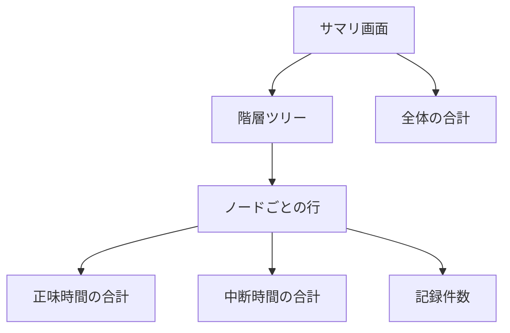

# FR-SUM-001 記録した作業時間を集計して表示する

## 要求

利用者がサマリ画面を開くと、階層のノードごとに記録済みの時間ログを読み出し、
配下のノードの正味時間を合算し、フェーズ別の内訳を求めて、
親から子へたどれる形で画面に表示する。

<!-- 動詞: 開く / 読み出す / 合算する / 求める / 表示する = 5個 -->

## 理由

時間を記録できても、集計が見えなければ計測の目的を果たさない。
PSP は「どのフェーズにどれだけ時間を使ったか」を把握して次の計画に活かす方法論であり、
**内訳が見えて初めて改善の材料になる**。

M1 の到達点を「階層を作り、タスクの作業時間を記録できる」としているが、
記録したものを確認する手段がなければ、記録が正しいかも判断できない。

ドッグフーディングの観点でも、この移植プロジェクト自体の作業時間を
その場で確認できることが、記録を続ける動機になる。

## 説明

### M1 では計算式エンジンを使わない

⚠️ **本要求が扱うのは単純な合算のみである。** 派生指標（歩留まり、欠陥密度、
CPI、SPI）は計算式エンジンが担い、M3 以降で扱う。

M1 では TypeScript で直接集計を書く（約100行）。
M3 でエンジンに置き換える際、**呼び出し側のインタフェースを変えない設計**とし、
差し替えを局所化する。

```typescript
// M1: 直接計算
export function totalTime(entries: TimeLogEntry[]): number { … }

// M3 以降: エンジン経由に差し替え
export function totalTime(path: string): number {
  return repository.getValue(`${path}/Time`);
}
```

### 集計結果は保存しない

[ARC](../arc-architecture.md) の 3.4 で定めたとおり、**集計結果はデータベースに保存せず、
表示のたびに計算する**。

保存すると、時間ログの追加や修正のたびに整合を保つ責任が生じ、設計が二重になる。

```
https://github.com/ChestnutForest/processloop/blob/main/docs/phase1/arc-architecture.md
```

### 移植元との差異

| 項目 | 移植元 | 移植先（M1） | 判断 |
|---|---|---|---|
| 表示形式 | HTML レポート（`.shtm` テンプレート） | React コンポーネント | Web 化に伴う再設計 |
| 集計の実行 | 計算式エンジンが自動再計算 | TypeScript で直接計算 | M1 ではエンジンを使わないため |
| 派生指標 | 歩留まり、欠陥密度など多数 | **合計と内訳のみ** | M3 以降で追加 |
| 期間の絞り込み | 週次レポートなどが存在 | **扱わない** | 第1.5期以降 |

### 集計の単位

| 単位 | 内容 |
|---|---|
| ノード単体 | そのノードに直接記録された時間 |
| 配下を含む合計 | そのノードと、すべての子孫の合計 |
| フェーズ別 | プロセス定義が持つフェーズごとの内訳 |

⚠️ **フェーズはノードとして階層に存在する**（`FR-HIER-001` で展開される）。
したがってフェーズ別の内訳は、子ノードごとの合計と同じ計算になる。

### データの範囲

| 項目 | 範囲 |
|---|---|
| 表示する時間 | 0分以上 |
| 表示の単位 | 時間と分（例: 2時間30分） |
| 記録がないノード | 0分として表示する（非表示にしない） |
| 中断時間 | 合計とは別に表示する |

### 画面の構成



<details>
<summary>ソースを見る</summary>

````markdown

````

</details>

## 仕様

### <サマリ画面を開く>

- [ ] **FR-SUM-001.10** 階層画面からサマリ画面へ遷移できるようにする。
- [ ] **FR-SUM-001.20** 階層にノードが1つも存在しない場合、その旨を表示する。

### <時間ログの読み出し>

- [ ] **FR-SUM-001.110** 表示対象のノードとその子孫に紐づく時間ログを、すべて読み出す。
- [ ] **FR-SUM-001.120** 計測中の記録を集計に含めず、計測中のノードがある場合はその旨を表示する。

### <正味時間の合算>

- [ ] **FR-SUM-001.210** ノードに直接記録された正味時間を合算する。
- [ ] **FR-SUM-001.220** 子孫のノードに記録された正味時間を、親のノードの合計に含める。
- [ ] **FR-SUM-001.230** 中断時間を、正味時間とは別に合算する。
- [ ] **FR-SUM-001.240** 集計結果を保存せず、表示のたびに計算する。

### <フェーズ別の内訳>

- [ ] **FR-SUM-001.310** プロセス定義が割り当てられたノードについて、フェーズごとの合計を求める。
- [ ] **FR-SUM-001.320** 記録が存在しないフェーズを、0分として表示する。

### <画面への表示>

- [ ] **FR-SUM-001.410** 階層の親子関係が分かる形で、ノードを並べて表示する。
- [ ] **FR-SUM-001.420** 各ノードについて、正味時間の合計、中断時間の合計、記録件数を表示する。
- [ ] **FR-SUM-001.430** 時間を「時間と分」の形式で表示する。
- [ ] **FR-SUM-001.440** 全体の合計を、階層の一覧とは別に表示する。

## 関連資料

- 概要: [overview.md](overview.md)
- 依存する要求: [fr-hier-001.md](fr-hier-001.md) / [fr-time-001.md](fr-time-001.md)

```
https://github.com/ChestnutForest/processloop/blob/main/docs/phase1/req/fr-time-001.md
```

- 集計を保存しない方針: [arc-architecture.md](../arc-architecture.md) の 3.4

```
https://github.com/ChestnutForest/processloop/blob/main/docs/phase1/arc-architecture.md
```
