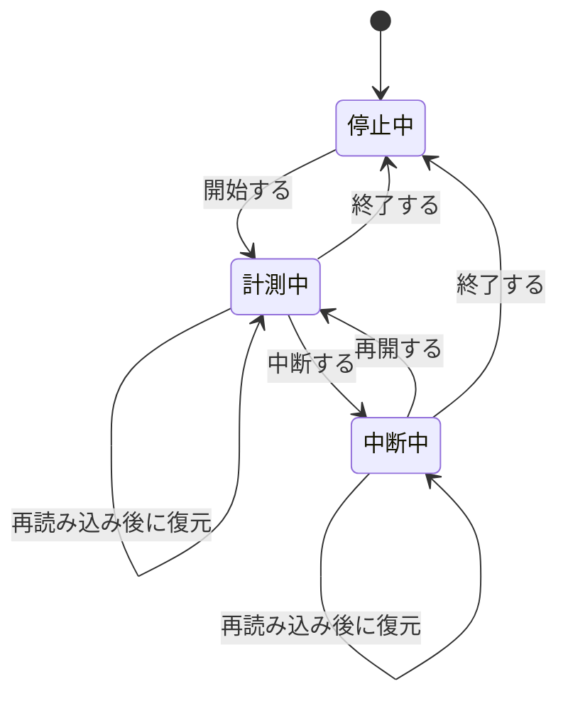

# FR-TIME-001 作業時間を計測して時間ログに記録する

## 要求

利用者が階層からタスクを選択して計測を開始すると、開始時刻を記録し、
正味作業時間を画面に表示し続け、中断の指示を受けたら中断時間を積算し、
計測状態を定期保存する。計測の終了時に作業区間を直接積算した正味時間を
時間ログに保存し、ブラウザを再読み込みしても未終了の計測を復元する。

<!-- 動詞: 選択する / 開始する / 記録する / 表示する / 積算する / 算出する / 保存する = 7個 -->

## 理由

PSP は、中断を除いた正味の作業時間を測ることを前提とする方法論である。
席にいた時間ではなく実際に作業していた時間を把握しなければ、
フェーズごとの工数配分も、次の見積りの根拠も得られない。

移植元の `timelog.xml` が経過時間（`delta`）と中断時間（`interrupt`）を
別々の属性として持つのは、この方法論上の必然による。移植先でも同じ分離を保つ。

加えて、[ADR-0001](../../adr/adr-0001-data-collection-first.md) により
この移植プロジェクト自体を PSP で計測する方針を採っている。
本要求が実現した時点から、開発者は自分の作業時間を記録できるようになる。

## 説明

### 移植元との差異

| 項目 | 移植元 | 移植先 | 判断 |
|---|---|---|---|
| 保存先 | `timelog.xml`（全ノード分を1ファイル） | SQLite（`TimeLogEntry` テーブル） | 検索と集計のため |
| `flag` 属性 | 同期用メタデータを保持 | **移植しない** | チーム同期は第2期のため |
| ノードとの関連 | `path` 属性の文字列一致 | `path` を保持しつつ外部キーでも結ぶ | 整合性を保つため |
| 計測状態 | デスクトッププロセス内で保持し、通常1分間隔で現在行を保存 | サーバへ通常1分間隔でチェックポイント保存 | ブラウザ終了・再読み込みで計測全体を失わないため |
| 時間の計測 | 壁時計 `Date` の差 | 表示中の区間は単調時計、開始時刻と復元はサーバ時刻 | 時計補正で継続時間が負になることを防ぐため |
| 倍率 | 作業時間と中断時間へ設定倍率を適用 | **M1では移植しない** | 実時間を収集し、倍率適用済みの移行値を再計算しないため |
| 完了直後の1分強制 | 限定条件で1分へ強制。既存時間判定にはコメントとの不一致がある | **M1では移植しない** | 不具合候補を互換対象にせず、通常の1分未満非保存を一貫させるため |

### データの範囲

| 項目 | 範囲 |
|---|---|
| 開始時刻 | サーバが受信時刻から生成する。APIではタイムゾーン付きISO 8601、DBではUTC |
| 正味時間 | 0 以上の整数（分）。新規記録は四捨五入する |
| 中断時間 | 0 以上の整数（分）。分未満を切り捨てる。正味時間を超えてよい |
| コメント | 0 〜 1000 文字 |

移植データは保存済みの `delta` と `interrupt` を再計算しない。負数、未来時刻、
親ノードのパス、0分の記録が含まれていても、移行処理では警告の対象にとどめて
読み込みを拒否しない。通常操作の値は、利用者入力ではなく計測状態から生成する。

### 状態遷移



<details>
<summary>ソースを見る</summary>

````markdown

````

</details>

## 仕様

### <タスクの選択>

- [ ] **FR-TIME-001.10** M1では、階層に登録されたノードのうち、末端のノードのみを計測対象として選択できるようにする。
- [ ] **FR-TIME-001.20** 選択中のノードのパスを画面に表示する。

### <計測の開始>

- [ ] **FR-TIME-001.110** 計測開始APIを受け付けたサーバの時刻を開始時刻とし、タイムゾーンを含む ISO 8601 形式で返す。
- [ ] **FR-TIME-001.120** 計測中に別のノードを選択した場合、実行中の計測を終了して保存してから、新しい計測を開始する。
- [ ] **FR-TIME-001.130** 既に計測中のノードを再度選択した場合、計測を継続し、新しい計測は開始しない。
- [ ] **FR-TIME-001.140** 別のブラウザ画面から新しい計測を開始した場合、新しい開始時刻で既存の計測を終了して保存し、新しい計測だけを実行中にする。

### <経過時間の表示>

- [ ] **FR-TIME-001.210** 中断を除いた正味作業時間を、1秒ごとに更新して時分秒で表示する。
- [ ] **FR-TIME-001.220** 中断中は正味作業時間の加算を止め、中断時間の加算を続ける。
- [ ] **FR-TIME-001.230** 中断中であることを、計測中とは異なる表示で区別する。
- [ ] **FR-TIME-001.240** 総経過時間は別の計測値として保存・表示しない。

### <中断時間の積算>

- [ ] **FR-TIME-001.310** 中断の指示を受けた時刻から、再開の指示を受けた時刻までを中断時間として積算する。
- [ ] **FR-TIME-001.320** 同一の計測中に複数回中断した場合、それぞれの中断時間を合算する。
- [ ] **FR-TIME-001.330** 中断したまま計測を終了した場合、終了時刻までを中断時間に含める。

### <正味時間の算出>

- [ ] **FR-TIME-001.410** 計測中の作業区間を直接積算し、正味時間として分単位で算出する。保存時に中断時間を再度差し引かない。
- [ ] **FR-TIME-001.420** 正味時間は四捨五入し、中断時間は分未満を切り捨てる。
- [ ] **FR-TIME-001.430** 正味時間が1分未満の場合、通常の時間ログを作成しない。

### <時間ログへの保存>

- [ ] **FR-TIME-001.510** 対象ノードのパス、開始時刻、正味時間、中断時間、コメントを1件の記録として保存する。

### <計測状態の保存と復元>

- [ ] **FR-TIME-001.610** 開始、中断、再開、終了の各操作時と、計測中は通常1分間隔で、最新の計測状態をサーバへ保存する。
- [ ] **FR-TIME-001.620** ブラウザの再読み込みまたは再起動後に未終了の計測状態が存在する場合、その状態と積算時間を復元する。
- [ ] **FR-TIME-001.630** 正常終了して時間ログを保存した後は、対応する未終了の計測状態を削除する。

## 関連資料

- 解析: `../../analysis/b1-b4-report.md`（永続化の4系統）
- 解析: `../../analysis/persistence-report.md`
- 移植元: `log/time/TimeLogIOConstants.java` @`bf5a4d6`
- 移植仕様: `../units/prt-b4-time-log.md`
- PSP 計測: `../../psp-data/README.md`
