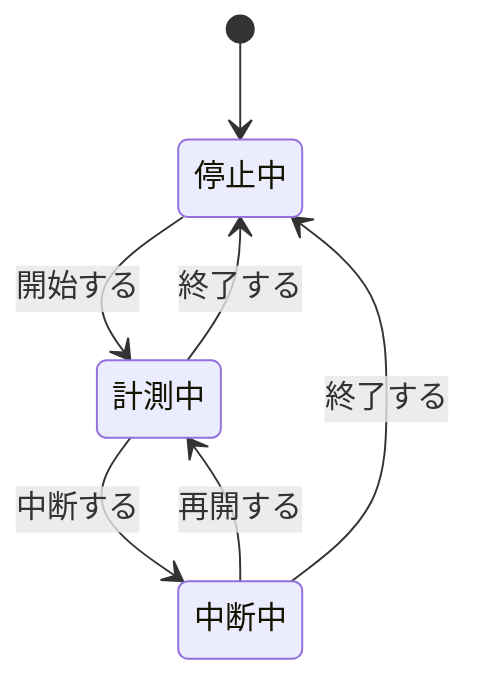

# FR-TIME-001 作業時間を計測して時間ログに記録する

## 要求

利用者が階層からタスクを選択して計測を開始すると、開始時刻を記録し、
経過時間を画面に表示し続け、中断の指示を受けたら中断時間を積算し、
計測の終了時に中断を除いた正味時間を算出して、時間ログに保存する。

<!-- 動詞: 選択する / 開始する / 記録する / 表示する / 積算する / 算出する / 保存する = 7個 -->

## 理由

PSP は、中断を除いた正味の作業時間を測ることを前提とする方法論である。
席にいた時間ではなく実際に作業していた時間を把握しなければ、
フェーズごとの工数配分も、次の見積りの根拠も得られない。

移植元の `timelog.xml` が経過時間（`delta`）と中断時間（`interrupt`）を
別々の属性として持つのは、この方法論上の必然による。移植先でも同じ分離を保つ。

加えて、[ADR-0001](../../adr/adr-0001-data-collection-first.md) により
この移植プロジェクト自体を PSP で計測する方針を採っている。
本要求が実現した時点から、開発者は自分の作業時間を記録できるようになる。

## 説明

### 移植元との差異

| 項目 | 移植元 | 移植先 | 判断 |
|---|---|---|---|
| 保存先 | `timelog.xml`（全ノード分を1ファイル） | SQLite（`TimeLogEntry` テーブル） | 検索と集計のため |
| `flag` 属性 | 同期用メタデータを保持 | **移植しない** | チーム同期は第2期のため |
| ノードとの関連 | `path` 属性の文字列一致 | `path` を保持しつつ外部キーでも結ぶ | 整合性を保つため |

### データの範囲

| 項目 | 範囲 |
|---|---|
| 開始時刻 | ISO 8601 形式。未来時刻は受け付けない |
| 経過時間 | 0 以上の整数（分） |
| 中断時間 | 0 以上、かつ経過時間以下の整数（分） |
| コメント | 0 〜 1000 文字 |

### 状態遷移

## 仕様

### <タスクの選択>

- [ ] **FR-TIME-001.10** 階層に登録されたノードのうち、末端のノードのみを計測対象として選択できるようにする。
- [ ] **FR-TIME-001.20** 選択中のノードのパスを画面に表示する。

### <計測の開始>

- [ ] **FR-TIME-001.110** 計測を開始した時刻を、実行環境のタイムゾーンを含む ISO 8601 形式で記録する。
- [ ] **FR-TIME-001.120** 計測中に別のノードを選択した場合、実行中の計測を終了して保存してから、新しい計測を開始する。
- [ ] **FR-TIME-001.130** 既に計測中のノードを再度選択した場合、計測を継続し、新しい計測は開始しない。

### <経過時間の表示>

- [ ] **FR-TIME-001.210** 計測の開始からの経過時間を、1秒ごとに更新して時分秒で表示する。
- [ ] **FR-TIME-001.220** 中断中は経過時間の加算を止め、中断時間の加算を続ける。
- [ ] **FR-TIME-001.230** 中断中であることを、計測中とは異なる表示で区別する。

### <中断時間の積算>

- [ ] **FR-TIME-001.310** 中断の指示を受けた時刻から、再開の指示を受けた時刻までを中断時間として積算する。
- [ ] **FR-TIME-001.320** 同一の計測中に複数回中断した場合、それぞれの中断時間を合算する。
- [ ] **FR-TIME-001.330** 中断したまま計測を終了した場合、終了時刻までを中断時間に含める。

### <正味時間の算出>

- [ ] **FR-TIME-001.410** 開始から終了までの経過時間から中断時間を差し引いた値を、正味時間として分単位で算出する。
- [ ] **FR-TIME-001.420** 算出結果が1分未満の場合、正味時間を 0 分として記録する。

### <時間ログへの保存>

- [ ] **FR-TIME-001.510** 対象ノードのパス、開始時刻、正味時間、中断時間、コメントを1件の記録として保存する。

## 関連資料

- 解析: `../../analysis/b1-b4-report.md`（永続化の4系統）
- 解析: `../../analysis/persistence-report.md`
- 移植元: `log/time/TimeLogIOConstants.java` @`bf5a4d6`
- 移植仕様: `../units/prt-b4-time-log.md`
- PSP 計測: `../../psp-data/README.md`
