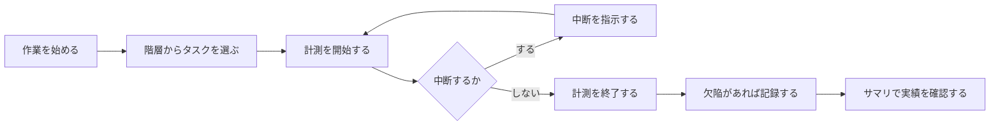

# Processloop 第1期 要件定義 概要

本書は個別の要求仕様の上位に置き、**システム化の目的と範囲**を示す。
IPA「機能要件の合意形成ガイド」の概要編に相当する。

合意成熟度の仕掛レベルは、システム化の目的と範囲を明確にして認識を共有する段階と
定義されている。本書はその段階を満たすことを目的とし、
**一覧と共通ルールまでを書き、詳細は個別の要求仕様に委ねる**。

記法の定義は [README.md](README.md)、図表の書き方は [diagram-guide.md](diagram-guide.md)、
根拠とした一次情報は [references.md](../../references.md) を参照。

---

## 1. システム化の目的

### 何を作るのか

Processloop は、**個人開発者が自分の開発プロセスを計測し改善するためのツール**である。

PSP（Personal Software Process、個人ソフトウェアプロセス）が定める方法にもとづき、
作業時間・欠陥・成果物規模を記録し、そこから見積りの精度と品質を高める。

### なぜ移植するのか

移植元の Process Dashboard は20年以上の実績を持つ Java 製デスクトップアプリケーションである。
その計算式資産（約1.2万行）と方法論の実装は価値が高い一方、
Swing による UI はデスクトップ環境に縛られる。

Web アプリケーションとして作り直すことで、環境を選ばず使えるようにする。
あわせて英語と日本語の切り替えに対応する。

### この開発自体を計測する

[ADR-0001](../../adr/adr-0001-data-collection-first.md) により、
**この移植プロジェクト自体を PSP で計測する**方針を採っている。

M1 が完成した時点から、Processloop を使って Processloop の開発を記録する。
蓄積したデータは PROBE（見積り手法）の検証に用いる。

この方針が実装順序を決めている。計算エンジンより先にデータ収集を作るのは、
PROBE が過去の見積りと実績の組を必要とし、履歴なしには検証できないためである。

---

## 2. 対象範囲

### 第1期に含むもの

| # | 機能 | 対応ユニット |
|---|---|---|
| 1 | プロジェクトを階層で構成し、PSP のプロセスを割り当てる | B-2, B-3 |
| 2 | 作業時間を計測する（中断を除いた正味時間） | B-4 |
| 3 | 欠陥を記録する（混入フェーズ・除去フェーズ） | B-5 |
| 4 | 過去データから規模と時間を見積もる（PROBE） | B-6 |
| 5 | 計画と実績の差を出来高で管理する（EV） | B-7, B-8 |
| 6 | 英語と日本語で表示する | — |

これらを支える基盤として、計算式エンジン（A-1〜A-7）と永続化層（B-9）を実装する。

### 第1期に含まないもの

| 除外するもの | 理由 | 扱い |
|---|---|---|
| チーム機能 | 個人の計測が先に成立する必要がある | 第2期 |
| TSP 相当の機能 | 移植元の GPL ソースにプロセス定義が存在しない | 第2期（汎用チームプロセスとして） |
| 既存データの移行 | 新規に使い始める前提 | 第1.5期 |
| WBS Editor | 85,634行と規模が大きく、必要性の判断が先 | 第4期で判断 |
| バッチ処理 | 第1期に該当する処理がない | 該当なし |
| 帳票の印刷・出力 | 画面表示で足りる | 第1.5期以降 |

### 移植元との対応

移植元 Process Dashboard は Java 2,006ファイル・399,364行である。
第1期スコープはそのうち651ファイル・134,534行（33.7%）に対応する。

TypeScript への移植後は **19,000〜21,000行**を見込む。
圧縮が効くのは、Swing UI を破棄すること、既存ライブラリで代替できる部分があること、
そして言語の簡潔さによる。

---

## 3. 利用者と利用場面

### 利用者

**個人の開発者**を想定する。第1期では単一利用者のみを扱い、
複数人での利用、権限管理、認証は第2期の対象とする。

### 利用場面



<details>
<summary>ソースを見る</summary>

````markdown

````

</details>

日々の作業でこの流れを繰り返し、蓄積したデータを次の見積りに使う。

---

## 4. 用語集

移植元および PSP に由来する用語を定義する。
**要求仕様ではこの表記に統一する。**

### PSP の方法論に関する用語

| 用語 | 定義 |
|---|---|
| **PSP** | Personal Software Process。個人が自分の開発プロセスを計測し改善する方法論 |
| **フェーズ** | 開発工程の単位。計画・設計・コード・コンパイル・テスト・事後分析など |
| **正味時間** | 中断を除いた実際の作業時間。PSP はこれを測ることを前提とする |
| **中断時間** | 計測中に作業から離れていた時間。正味時間から除外する |
| **混入フェーズ** | 欠陥が作り込まれた工程 |
| **除去フェーズ** | 欠陥が発見され修正された工程 |
| **評価フェーズ** | 欠陥を見つけることを目的とする工程。設計レビュー、コードレビューなど |
| **失敗フェーズ** | 欠陥が表面化する工程。コンパイル、単体テストなど |
| **歩留まり** | ある工程までに除去できた欠陥の割合 |
| **欠陥密度** | 成果物規模あたりの欠陥数 |
| **PROBE** | PROxy Based Estimating。過去の見積りと実績に回帰分析をかけて見積もる手法 |
| **EV** | Earned Value。出来高管理。計画に対する進捗を金額または工数で測る |
| **CPI / SPI** | Cost / Schedule Performance Index。コストと進捗の効率を表す指標 |

### 移植元の構造に関する用語

| 用語 | 定義 |
|---|---|
| **階層** | プロジェクトをタスクの木構造で表したもの。移植元では `state` ファイルに保存される |
| **パス** | 階層内の位置を表す文字列。`/Project/Design` の形式。全データの結合キーになる |
| **プロセス定義** | PSP0〜PSP3 のフェーズ構成。`PSP-template.xml` に記述される |
| **テンプレート ID** | プロセス定義の識別子。`PSP2` など。階層ノードがこれを参照する |
| **計算式エンジン** | データ定義から派生指標を計算する仕組み。5層構造を持つ |
| **ゴールデンファイル** | 移植の検証に使う正解データ。移植元を実行して得た出力 |

### 本プロジェクト固有の用語

| 用語 | 定義 |
|---|---|
| **ユニット** | 移植の作業単位。A群7・B群10・C群1の計18 |
| **マイルストーン（M1〜M6）** | 実装の到達点。M1 でドッグフーディングを開始する |
| **上流ピン** | 移植の基準とする移植元のコミット。`bf5a4d6`（Process Dashboard 2.7.6） |
| **合意成熟度** | 要求仕様の熟度。仕掛・充実・完成の3段階 |

⚠️ **PSP、TSP、Personal Software Process、Team Software Process は
カーネギーメロン大学のサービスマークである。** 本プロジェクトは同大学および
ソフトウェア工学研究所とは提携していない。これらの名称は方法論を指す
記述的用法としてのみ使用し、製品名やブランドとしては使用しない。

---

## 5. 技術領域のカバレッジ

IPA「機能要件の合意形成ガイド」が定める6技術領域のうち、第1期で扱うものを示す。

| 技術領域 | `domains` の値 | 第1期 | 内容 |
|---|---|---|---|
| システム振舞い | `behavior` | ✅ **扱う** | 計測の状態遷移、階層操作、計算式の評価 |
| 画面 | `screen` | ✅ **扱う** | 5画面の構成・遷移・入出力項目 |
| データモデル | `data_model` | ✅ **扱う** | 4モデルの定義と関連 |
| 外部インタフェース | `external_if` | △ **一部** | Route Handlers のみ。OpenAPI で別管理 |
| バッチ | `batch` | ❌ 扱わない | 該当する処理がない |
| 帳票 | `report` | ❌ 扱わない | 画面表示で足りる |

**全部を埋めようとしない。** 該当のない領域を無理に記述すると形骸化する。
バッチと帳票は、該当が生じた時点で追加する。

技術領域に該当しない要求（ライセンス順守など）は `domains: [none]` を指定する。

---

## 6. 共通ルール

個別の要求仕様に繰り返し書かず、本書で一度だけ定める。

### 時刻と時間

| 項目 | ルール |
|---|---|
| 時刻の表現 | ISO 8601 形式。タイムゾーンを含める |
| 時間の単位 | 分。秒以下は切り捨てる |
| 内部の保持 | UTC で保持し、表示時に実行環境のタイムゾーンへ変換する |

### 文字列

| 項目 | ルール |
|---|---|
| 文字コード | UTF-8（BOM なし） |
| 改行 | LF |
| 空文字と null | 未入力は null とし、空文字を使わない |

### 画面に表示する文言

すべて i18n のメッセージキーを介する。**画面に文字列を直接書かない。**

```
i18n/messages/en.json
i18n/messages/ja.json
```

画面の入出力項目一覧には、対応するキーの列を設ける。

### エラーの扱い

| 状況 | 振る舞い |
|---|---|
| 入力値が範囲外 | 保存せず、該当項目にエラーを表示する |
| 対象が存在しない | 一覧へ戻り、その旨を表示する |
| 保存に失敗した | 入力内容を保持したまま、再試行できる状態にする |

### 移植元との差異

移植元の挙動を変える場合、**要求仕様の「説明」に差異と判断理由を書く**。
黙って変えない。既存の計算式資産が依存している挙動を壊す恐れがあるためである。

---

## 7. 要求の一覧

⚠️ **本節は Front Matter から自動生成する予定である。** 現時点は手書きであり、
要求ファイルが増えたらスクリプトによる生成に切り替える。

### M1 に必要な要求

| ID | 表題 | ユニット | 状態 |
|---|---|---|---|
| `FR-HIER-001` | 階層を構成してプロセスを割り当てる | B-2, B-3 | 🟡 `draft` |
| `FR-TIME-001` | 作業時間を計測して時間ログに記録する | B-4 | 🟡 `draft` |
| `FR-SUM-001` | 記録した作業時間を集計して表示する | C | 🟡 `draft` |
| `NFR-I18N-001` | 英語と日本語で表示を切り替える | C | 🟡 `draft` |
| `NFR-DATA-001` | 記録したデータを永続化して再起動後も参照できるようにする | B-9 | 🟡 `draft` |
| `CON-LICENSE-001` | GPLv3 を維持して移植元の帰属を保持する | C | 🟡 `draft` |

### M2 以降に必要な要求（未着手）

| M | 想定する要求 |
|---|---|
| M2 | `FR-DEF-001`（欠陥を記録する） |
| M3 | `FR-CALC-001`〜（計算式の評価） |
| M4 | `FR-PROBE-001`（回帰分析による見積り） |
| M5 | `FR-EV-001`〜（計画対実績、完了予測） |

第1期全体で **20〜30本**を見込む。

---

## 8. 移植元との関係

### 要求の源泉

新規開発では要求の源泉は依頼者にあるが、**移植では移植元の挙動が源泉**になる。

そのため各要求の Front Matter に `source` を持たせ、
根拠となるファイルと上流のコミット SHA を記録する。

```yaml
source:
  upstream_sha: bf5a4d63aff08410f79840001c816b37392e5001
  files:
    - src/net/sourceforge/processdash/log/time/TimeLogIOConstants.java
  analysis_refs:
    - ANA-B4
```

### 上流ピン

| 項目 | 値 |
|---|---|
| リポジトリ | https://github.com/dtuma/processdash |
| コミット | `bf5a4d63aff08410f79840001c816b37392e5001` |
| バージョン | Process Dashboard 2.7.6 |
| 日付 | 2026-05-28 |

移植の判断はすべてこの一点に固定されたソースにもとづく。
上流が更新されても、本プロジェクトの基準は変わらない。

### 解析済みの資料

要求を書く際は、既存の解析レポートを根拠として参照する。

| 領域 | 参照先 |
|---|---|
| 全体構造 | [architecture-analysis.md](../../architecture-analysis.md) |
| 永続化 | `docs/analysis/b1-b4-report.md`（配置予定） |
| 計算エンジン | `docs/analysis/preprocessor-report.md`（配置予定） |

⚠️ 解析レポート17本は現在リポジトリ外にある。
`docs/analysis/` への配置は今後の作業とする。

---

## 9. 本書の位置づけと更新

本書は仕掛レベルの粒度で書いている。**書ききることを目的としない。**

個別の要求仕様を書き進める中で、用語の追加や共通ルールの明確化が生じたら、
その都度ここに反映する。**概要と詳細を並行して育てる。**

| 節 | 更新の契機 |
|---|---|
| 用語集 | 新しい用語が要求仕様に現れたとき |
| 共通ルール | 複数の要求で同じ記述を繰り返しそうになったとき |
| 要求の一覧 | 要求を追加・完了したとき（将来は自動生成） |
| 技術領域のカバレッジ | 該当する領域が増えたとき |
