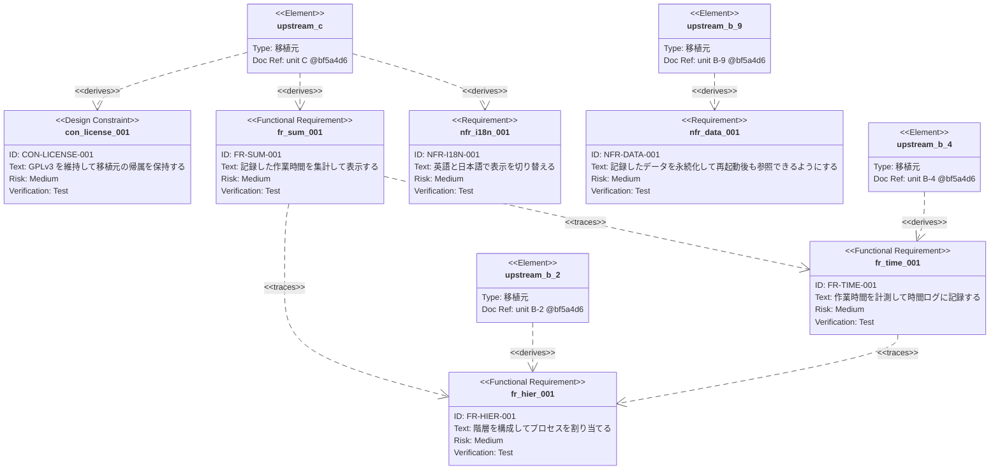

# トレーサビリティマトリクス — 2案の比較

要求仕様の Front Matter から自動生成した。生成元は `scripts/generate-tm.mjs`。

**本書は比較用である。** どちらの形式を採用するかを決めた後、
採用した方を `docs/phase1/traceability-matrix.md` として確定させる。

```
https://github.com/ChestnutForest/processloop/tree/main/docs/phase1/req
```

---

# 案A：表形式

Markdown の表で4つの観点を示す。

---

## 工程別の対応

| 要求 | 表題 | 解析 | ユニット | 移植仕様 | 実装 | テスト | 状態 |
|---|---|---|---|---|---|---|---|
| [`CON-LICENSE-001`](req/con-license-001.md) | GPLv3 を維持して移植元の帰属を保持する | ANA-LICENSE | C | PRT-C | SRC-C | — | `reviewed` |
| [`FR-HIER-001`](req/fr-hier-001.md) | 階層を構成してプロセスを割り当てる | ANA-B2<br>ANA-B3 | B-2 | PRT-B2 | SRC-B2 | UT-B2<br>IT-01 | `reviewed` |
| [`FR-SUM-001`](req/fr-sum-001.md) | 記録した作業時間を集計して表示する | ANA-B4 | C | PRT-C | SRC-C | UT-C<br>IT-02<br>ST-01 | `reviewed` |
| [`FR-TIME-001`](req/fr-time-001.md) | 作業時間を計測して時間ログに記録する | ANA-B4<br>ANA-B9 | B-4 | PRT-B4 | SRC-B4 | UT-B4<br>IT-01 | `reviewed` |
| [`NFR-DATA-001`](req/nfr-data-001.md) | 記録したデータを永続化して再起動後も参照できるようにする | ANA-B9 | B-9 | PRT-B9 | SRC-B9 | UT-B9<br>IT-01 | `reviewed` |
| [`NFR-I18N-001`](req/nfr-i18n-001.md) | 英語と日本語で表示を切り替える | ANA-I18N | C | PRT-C | SRC-C | UT-C<br>ST-01 | `reviewed` |

## 移植元の根拠

| 要求 | 移植元のファイル | 上流SHA |
|---|---|---|
| `CON-LICENSE-001` | `README-license.txt`<br>`src/net/sourceforge/processdash/util/StringUtils.java` | `bf5a4d6` |
| `FR-HIER-001` | `src/net/sourceforge/processdash/hier/DashHierarchy.java`<br>`src/net/sourceforge/processdash/hier/PropertyKey.java`<br>`Templates/PSP-template.xml` | `bf5a4d6` |
| `FR-SUM-001` | `src/net/sourceforge/processdash/ui/web/reports/`<br>`src/net/sourceforge/processdash/log/time/TimeLogEntry.java` | `bf5a4d6` |
| `FR-TIME-001` | `src/net/sourceforge/processdash/log/time/TimeLogIOConstants.java`<br>`src/net/sourceforge/processdash/log/time/TimeLogEntry.java` | `bf5a4d6` |
| `NFR-DATA-001` | `src/net/sourceforge/processdash/hier/DashHierarchy.java`<br>`src/net/sourceforge/processdash/log/time/TimeLogIOConstants.java` | `bf5a4d6` |
| `NFR-I18N-001` | `src/net/sourceforge/processdash/i18n/Resources.java`<br>`Templates/resources/ProcessDashboard_ja.properties` | `bf5a4d6` |

## 技術領域のカバレッジ

| 要求 | behavior | screen | data_model | external_if | batch | report | none |
|---|---|---|---|---|---|---|---|
| `CON-LICENSE-001` |  |  |  |  |  |  | O |
| `FR-HIER-001` | O | O | O |  |  |  |  |
| `FR-SUM-001` | O | O |  |  |  |  |  |
| `FR-TIME-001` | O | O | O |  |  |  |  |
| `NFR-DATA-001` | O |  | O |  |  |  |  |
| `NFR-I18N-001` |  | O |  |  |  |  |  |

## 規模

| 要求 | 仕様数 |
|---|---|
| `CON-LICENSE-001` | 12 |
| `FR-HIER-001` | 17 |
| `FR-SUM-001` | 14 |
| `FR-TIME-001` | 14 |
| `NFR-DATA-001` | 15 |
| `NFR-I18N-001` | 13 |
| **合計** | **85** |


---

# 案B：Mermaid の要求図

SysML 1.6 にもとづく Requirement Diagram で、要求と移植元の関係を図示する。

---




---

# 比較

## 表せる情報

| 情報 | 案A（表） | 案B（図） |
|---|---|---|
| 要求と工程の対応（ANA→PRT→SRC→テスト） | ✅ 一覧できる | ❌ 表せない |
| 移植元のファイルと上流SHA | ✅ 具体的に載る | △ docref に短く書くのみ |
| 技術領域のカバレッジ | ✅ 抜けが見える | ❌ 表せない |
| 仕様数と合計 | ✅ 集計できる | ❌ 表せない |
| 要求間の依存関係 | △ 別欄が要る | ✅ **線で見える** |
| `status` | ✅ 載る | ❌ 表せない |

## 実務での使いやすさ

| 観点 | 案A | 案B |
|---|---|---|
| 特定の要求を探す | ✅ ページ内検索が効く | △ 図中の文字は検索しにくい |
| リンクを張る | ✅ 要求ファイルへ直接飛べる | ❌ 図からは飛べない |
| 要求が20本を超えたとき | ✅ 縦に伸びるだけ | ❌ **線が交差して読めなくなる** |
| 差分の読みやすさ | ✅ 行単位で分かる | △ ソースは読めるが図の変化は分からない |
| 全体像の把握 | △ 表を追う必要がある | ✅ **一目で関係が見える** |

## 生成の手間

どちらも同じスクリプトから出力できるため、**生成の手間に差はない**。

---

# 判断のための論点

## 論点1：G1 の条件を満たすのはどちらか

工程ゲート G1 は「TM の**骨格**ができている」と定めている。

骨格とは工程間の対応が追える状態であり、**`ANA → FR → PRT → SRC → テスト`
の連鎖が示されている必要がある**。案Bはこの連鎖を表せない。

## 論点2：要求が増えたときどうなるか

第1期全体で20本から30本を見込む。

案Aは行が増えるだけだが、**案Bは線の交差が急増して読めなくなる**。
Mermaid は要素の位置を指定できないため、自動配置に委ねるしかない。

## 論点3：両方を置く選択肢

排他ではない。**表を主とし、図を補助として添える**ことができる。

| 用途 | 形式 |
|---|---|
| 工程の追跡（G1 の条件） | 表 |
| 依存関係の把握 | 図 |

⚠️ ただし二重管理にはならない。**どちらも同じ Front Matter から生成する**ため、
生成し直せば両方が同時に更新される。

---

# 推奨

**案A（表）を主とし、案B（図）を「要求間の依存」の節にのみ添える。**

理由は3つある。

第1に、G1 の条件が工程間の対応を求めており、図では表せない。

第2に、要求が20本を超えると図が読めなくなる。第1期の見込みは20本から30本である。

第3に、図が唯一優れている「依存関係の把握」は、現時点で3件しかない。
`FR-SUM-001 → FR-HIER-001` `FR-SUM-001 → FR-TIME-001` `FR-TIME-001 → FR-HIER-001` であり、
表でも十分に表せる規模である。

⚠️ ただし依存が増えれば図の価値は上がる。**第2期でチーム機能が加わり
要求間の関係が複雑になった時点で、図の比重を上げることを検討する。**
