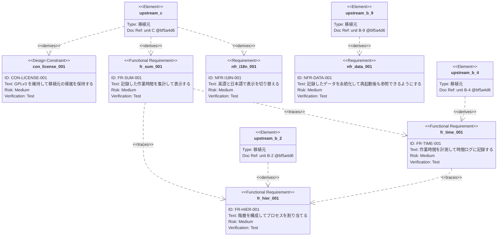

# トレーサビリティマトリクス（第1期）

要求仕様の Front Matter から自動生成する。**手で編集しない。**

```powershell
node scripts/generate-tm.mjs --both > docs/phase1/traceability-matrix.md
```

生成元は `docs/phase1/req/` 配下の `fr-` `nfr-` `con-` で始まるファイルである。

```
https://github.com/ChestnutForest/processloop/tree/main/docs/phase1/req
```

## 形式の方針

**表を主とし、図を補助とする**（2026-08-10 決定）。

工程ゲート G1 は「TM の骨格ができている」ことを条件とし、
骨格とは `ANA → 要求 → PRT → SRC → テスト` の連鎖が追える状態を指す。
Mermaid の Requirement Diagram は要求どうしの関係を表す記法であり、
この連鎖を表せないため、主にはできない。

図は「要求間の依存」を一目で把握する補助として添える。
⚠️ 要求が20本を超えると線の交差で読めなくなる見込みであり、
その時点で図の扱いを見直す。

## ID の体系

| 接頭辞 | 工程 |
|---|---|
| `ANA-` | 移植元の解析 |
| `FR-` / `NFR-` / `CON-` | 要求定義 |
| `PRT-` | プログラム設計（移植仕様書） |
| `SRC-` | 実装 |
| `UT-` / `IT-` / `ST-` | 単体・結合・総合テスト |

---

## 工程別の対応

| 要求 | 表題 | 解析 | ユニット | 移植仕様 | 実装 | テスト | 状態 |
|---|---|---|---|---|---|---|---|
| [`CON-LICENSE-001`](req/con-license-001.md) | GPLv3 を維持して移植元の帰属を保持する | ANA-LICENSE | C | PRT-C | SRC-C | — | `reviewed` |
| [`FR-HIER-001`](req/fr-hier-001.md) | 階層を構成してプロセスを割り当てる | ANA-B2<br>ANA-B3 | B-2 | PRT-B2 | SRC-B2 | UT-B2<br>IT-01 | `reviewed` |
| [`FR-SUM-001`](req/fr-sum-001.md) | 記録した作業時間を集計して表示する | ANA-B4 | C | PRT-C | SRC-C | UT-C<br>IT-02<br>ST-01 | `reviewed` |
| [`FR-TIME-001`](req/fr-time-001.md) | 作業時間を計測して時間ログに記録する | ANA-B4<br>ANA-B9 | B-4 | PRT-B4 | SRC-B4 | UT-B4<br>IT-01 | `reviewed` |
| [`NFR-DATA-001`](req/nfr-data-001.md) | 記録したデータを永続化して再起動後も参照できるようにする | ANA-B9 | B-9 | PRT-B9 | SRC-B9 | UT-B9<br>IT-01 | `reviewed` |
| [`NFR-I18N-001`](req/nfr-i18n-001.md) | 英語と日本語で表示を切り替える | ANA-I18N | C | PRT-C | SRC-C | UT-C<br>ST-01 | `reviewed` |

## 移植元の根拠

| 要求 | 移植元のファイル | 上流SHA |
|---|---|---|
| `CON-LICENSE-001` | `README-license.txt`<br>`src/net/sourceforge/processdash/util/StringUtils.java` | `bf5a4d6` |
| `FR-HIER-001` | `src/net/sourceforge/processdash/hier/DashHierarchy.java`<br>`src/net/sourceforge/processdash/hier/PropertyKey.java`<br>`Templates/PSP-template.xml` | `bf5a4d6` |
| `FR-SUM-001` | `src/net/sourceforge/processdash/ui/web/reports/`<br>`src/net/sourceforge/processdash/log/time/TimeLogEntry.java` | `bf5a4d6` |
| `FR-TIME-001` | `src/net/sourceforge/processdash/log/time/TimeLogIOConstants.java`<br>`src/net/sourceforge/processdash/log/time/TimeLogEntry.java` | `bf5a4d6` |
| `NFR-DATA-001` | `src/net/sourceforge/processdash/hier/DashHierarchy.java`<br>`src/net/sourceforge/processdash/log/time/TimeLogIOConstants.java` | `bf5a4d6` |
| `NFR-I18N-001` | `src/net/sourceforge/processdash/i18n/Resources.java`<br>`Templates/resources/ProcessDashboard_ja.properties` | `bf5a4d6` |

## 技術領域のカバレッジ

| 要求 | behavior | screen | data_model | external_if | batch | report | none |
|---|---|---|---|---|---|---|---|
| `CON-LICENSE-001` |  |  |  |  |  |  | O |
| `FR-HIER-001` | O | O | O |  |  |  |  |
| `FR-SUM-001` | O | O |  |  |  |  |  |
| `FR-TIME-001` | O | O | O |  |  |  |  |
| `NFR-DATA-001` | O |  | O |  |  |  |  |
| `NFR-I18N-001` |  | O |  |  |  |  |  |

## 規模

| 要求 | 仕様数 |
|---|---|
| `CON-LICENSE-001` | 12 |
| `FR-HIER-001` | 17 |
| `FR-SUM-001` | 14 |
| `FR-TIME-001` | 14 |
| `NFR-DATA-001` | 15 |
| `NFR-I18N-001` | 13 |
| **合計** | **85** |


## 要求間の依存（補助）


