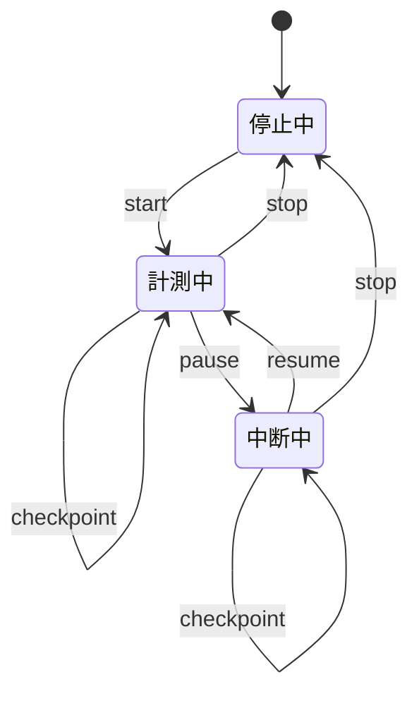

# 移植仕様書: B-4 時間ログ

## 1. 移植元の解析

詳細は [ANA-B4](../../analysis/ana-b4.md) を正本とする。本書では移植設計へ影響する
事実だけを要約する。

- `delta` は中断を除いた作業区間を直接積算した正味時間である。
- 作業時間は四捨五入し、中断時間は分未満を切り捨てる。
- 通常は1分未満のレコードを作らない。
- 中断は再開時に確定され、長い末尾中断を記録から除外する場合がある。
- XML読込みは負数、未来時刻、`interrupt > delta` を拒否しない。
- 親ノードは `Time_Logging_Allowed` が明示された場合だけ計測できる。
- 倍率設定は作業時間と中断時間の両方に適用される。
- 完了直後の1分強制には、コメントと実装の参照変数が一致しない箇所がある。
- 中核モデルは現在行を通常1分間隔で保存する。
- 主画面と既存Web制御の停止操作は正式終了ではなく中断である。
- 計測中のタスク切替は旧記録を確定してから新しいタスクの計測を続ける。
- 既存Web状態取得は選択パスと計測中かだけを返し、時間やversionを返さない。
- 現在セッションの1秒表示、再読込み復元、明示終了、楽観ロックには直接対応がない。

対象ファイルは Tuma Solutions 著作のGPLv3以降であり、ANA-B4で第三者著作物が
含まれないことを確認済みである。移植するTypeScriptには上流ファイル名とSHAを記す。

## 2. 確定した移植方針

### 2.1 互換性の境界

| 論点 | 新規計測 | 既存データ移行 | 判断理由 |
|---|---|---|---|
| `delta` | 作業区間を直接積算 | 保存値を正味時間として無変換 | 中断を再度引かない |
| 丸め | 作業は四捨五入、中断は切り捨て | 整数値を無変換 | 移植元互換 |
| 1分未満 | ログを作らない | 0分ログも保持 | 既存データを拒否しない |
| 開始時刻 | サーバ生成UTC、APIはISO 8601 | `@epochミリ秒`を同じ瞬間へ変換 | 表現だけをWeb API向けに変更 |
| 値の検証 | 状態遷移から非負値を生成 | 負数・未来・大小関係を警告だけで保持 | 移行不能を防ぐ |
| 親ノード | M1は末端限定 | 親パスを保持 | M1にマーカー基盤がない |
| 倍率 | M1では提供しない | 倍率適用済みの値を保持 | 元倍率は復元不能 |
| 1分強制 | M1では提供しない | 既存の1分値を保持 | 不具合候補を再現しない |

### 2.2 Web化に伴う意図的な変更

移植元のデスクトッププロセス内状態に代えて、未終了の計測を
`ActiveTimeSession` としてサーバへ保存する。これにより、ブラウザの再読み込み、終了、
クラッシュ後も最新チェックポイントから復元できる。

移植元と異なり、明示的な終了では中断中の現在区間を終了時刻まで中断時間へ含める。
利用者が明示した中断区間を欠落させず、復旧後も同じ規則で計算できるようにするためである。
既存ログの `interrupt` は推測で補正しない。

### 2.3 確定した確認事項

| 確認事項 | 結論 |
|---|---|
| 未来時刻の判定 | 通常操作の時刻はサーバが生成するため、許容誤差を設けない。移行値は拒否しない |
| ブラウザ終了・再読み込み | サーバの未終了セッションから復元する。通常1分間隔と操作時に保存する |
| 1秒表示の意味 | 中断を除いた正味作業時間。総経過時間は別表示しない |
| 親ノードの将来対応 | M1は末端限定。M3以降に明示マーカーを実装できる拡張点を残す |
| 完了直後の1分強制 | M1では実装しない。必要になった時点で別要求として意図した仕様を定義する |

### 2.4 第3段階Aで確定したAPI・画面境界

サーバの `ActiveTimeSession` を計測状態の正本とし、画面内の選択ノードと区別する。
画面が送るノード情報は `nodeId` だけとし、Route Handlerがサーバ側でノードを取得して
末端判定を行い、保存するパスはデータベースの値から組み立てる。

| 画面操作 | セッションなし | 計測中 | 中断中 |
|---|---|---|---|
| 同じノードを選択 | 選択だけを変更 | 何もしない | 何もしない |
| 別ノードを選択 | 選択だけを変更 | 旧ログ確定と新規開始を原子的に行う | 旧セッションを終了し、新しい選択は停止中にする |
| 開始・再開 | 選択ノードを開始 | 何もしない | 同じセッションを再開 |
| 中断 | 何もしない | 現在区間を確定して中断 | 何もしない |
| 終了 | 何もしない | ログ確定後にセッション削除 | 末尾中断を含めてログ確定後にセッション削除 |

別ノード選択中のAPIが失敗した場合、画面は切替成功を表示せず、サーバから現在セッションを
再取得する。中断中の別ノード選択で終了する挙動は、移植元がタスク変更時に現在行を
解放し、計測を再開しない挙動に対応する。

移植元の主画面に終了専用操作はないが、FR-TIME-001.330、.510、.630を満たすため、
移植先は中断とは別に終了ボタンを提供する。移植元の自動計測行はコメントを `null` で
作るため、第3段階Cのタイマー画面にはコメント入力を設けない。`stop` APIは将来の入力経路に
備えて0〜1000文字の省略可能なコメントを受け付け、省略時は `null` とする。

`GET /api/time-session` はセッションがない場合も復元処理の正常結果として200を返す。
更新対象のセッションやノードがなければ404、不正な入力は400、version競合と状態競合は
409、予期しない失敗は500とする。本文は文言ではなくメッセージキーを返す。
409を受けた画面は現在セッションを再取得する。

上流のローカル送信元制限、最近使ったパス、警告音、倍率、完了タスク警告、長時間計測警告は
M1の第3段階B・Cへ移植しない。Route HandlersはARC 7章の内部APIとし、認証・権限管理は
第2期で扱う。

## 3. 状態と時間計算

### 3.1 状態



個人利用のM1では未終了セッションを同時に1件だけ許可する。新しい `start` が既存の
セッションと異なるノードに対して届いた場合、サーバ受信時刻で既存セッションを終了し、
正式ログへの変換後に新しいセッションを作る。同じノードなら既存セッションを返す。

### 3.2 積算

セッションは丸め前の `workMillis` と `interruptMillis` を保持する。

- `running` 区間の終了時に、その区間を `workMillis` へ加える。
- `paused` 区間の終了時に、その区間を `interruptMillis` へ加える。
- 同じ区間を二度加えないよう、状態遷移と `stateChangedAt` 更新を同一トランザクションで行う。
- 画面内では単調時計で現在区間を表示し、チェックポイントではその区間の経過ミリ秒を送る。
- サーバは受信した区間を現在状態の積算値へ加え、`stateChangedAt` を受信時刻へ更新する。
- 復元時は最後のチェックポイント以降だけ、`stateChangedAt` からサーバ受信時刻までを現在状態の区間として扱う。
- APIではBigIntのミリ秒値を10進文字列として表現する。

正常終了時の保存値は次のとおりである。

```text
delta = floor(workMillis / 60_000 + 0.5)
interrupt = floor(interruptMillis / 60_000)
```

丸め前の正味作業時間が60,000ミリ秒未満なら `TimeLogEntry` を作らない。
`interrupt` は `delta` を超えてよい。

## 4. 型と関数の構成

### 4.1 ディレクトリ構成

```text
packages/core/src/time-log/
├─ clock.ts
├─ session.ts
├─ rounding.ts
├─ types.ts
├─ session.test.ts
└─ rounding.test.ts
```

永続化の実装は `packages/core/src/persistence/time-log.ts` と、追加する
`time-session.ts` に置く。`packages/core` はブラウザAPIやNext.jsへ依存しない。

### 4.2 型

```typescript
export type TimeSessionState = 'running' | 'paused';

export interface ActiveTimeSession {
  readonly nodeId: number;
  readonly path: string;
  readonly start: Date;
  readonly state: TimeSessionState;
  readonly workMillis: number;
  readonly interruptMillis: number;
  readonly stateChangedAt: Date;
  readonly version: number;
  readonly updatedAt: Date;
}
```

`Date` はサーバの時点を表し、区間計算へ直接依存させない。テスト可能にするため、現在時刻は
`Clock` インターフェースから受け取る。ブラウザの単調時計はfrontend側の表示用アダプターとする。

### 4.3 関数

| 関数 | 主な入力 | 戻り値・効果 |
|---|---|---|
| `startSession` | node、サーバ時刻 | 既存セッションを必要なら終了し、新規または既存セッションを返す |
| `pauseSession` | version、サーバ時刻 | 作業区間を確定して `paused` へ移す |
| `resumeSession` | version、サーバ時刻 | 中断区間を確定して `running` へ移す |
| `checkpointSession` | version、単調時計で測った現在区間 | 現在区間を積算し、最新状態を保存する |
| `stopSession` | version、コメント、サーバ時刻 | 現在区間を確定し、ログ作成とセッション削除を行う |
| `restoreSession` | なし | 未終了セッションと復元時点の表示値を返す |
| `roundTimeLog` | ミリ秒の作業・中断 | 保存用の分値または非保存判定を返す |

各更新は `version` による楽観ロックを行う。古い画面からの更新は競合として拒否し、
最新セッションを再取得させる。

## 5. APIとトランザクション

Route HandlersはARC 7.2の `/api/time-session/*` を提供する。クライアントは開始時刻や
状態遷移時刻を指定せず、サーバが受信時刻を採用する。

`stop` と、新しい `start` による既存セッションの打切りでは、次を単一の
データベーストランザクションで行う。

1. `version` と現在状態を検証する。
2. 現在区間を積算する。
3. 1分以上なら `TimeLogEntry` を作る。
4. `ActiveTimeSession` を削除する。
5. 新しい `start` の場合だけ次のセッションを作る。

## 6. 単体・結合テスト仕様

### 6.1 単体テスト

| ID | 条件 | 期待結果 |
|---|---|---|
| UT-B4-01 | 59秒999ミリ秒で終了 | ログを作らない |
| UT-B4-02 | 1分29秒999ミリ秒の作業 | `delta=1` |
| UT-B4-03 | 1分30秒の作業 | `delta=2` |
| UT-B4-04 | 1分59秒の中断 | `interrupt=1` |
| UT-B4-05 | 中断を複数回行う | 各中断区間を合算する |
| UT-B4-06 | 中断中に終了 | 終了時刻までを中断へ加える |
| UT-B4-07 | 時計表示中に壁時計が逆行 | 単調時計による表示値は減らない |
| UT-B4-08 | 同じノードを再度開始 | 新しいセッションを作らない |
| UT-B4-09 | 異なるノードを開始 | 既存を打ち切り、新規だけを実行中にする |
| UT-B4-10 | 古いversionで更新 | 競合エラーになる |

### 6.2 結合テスト

| ID | 条件 | 期待結果 |
|---|---|---|
| IT-B4-01 | 開始後に再読み込み | 未終了セッションを復元する |
| IT-B4-02 | 中断後に再読み込み | 正味時間は停止し、中断時間を継続する |
| IT-B4-03 | チェックポイント後にプロセスを再起動 | 保存済み状態から復元する |
| IT-B4-04 | 終了処理中にDBエラー | ログとセッションが半端に更新されない |
| IT-B4-05 | 移行データに `interrupt > delta` | 値を変更せず取り込める |
| IT-B4-06 | 移行データに0分・未来・負数 | 警告を記録し、行を保持できる |

ゴールデンファイルは、移植元を単独で安定実行できる時間計測境界に限って作る。
Web固有の復元・競合・トランザクションは通常の単体・結合テストで検証する。

### 6.3 整合性テストの意図

| テスト対象 | 防ぐ不整合 | 検証方法 |
|---|---|---|
| 楽観ロック | 古い画面からの更新が最新状態を上書きする | 最新versionを進めた後、古いversionの操作が競合エラーになり、最新状態を保つことを確認する |
| トランザクションの原子性 | 正式ログと未終了セッションの一方だけが更新される | ログINSERTを意図的に失敗させ、セッション削除もロールバックされることを確認する |

楽観ロックは「どの更新を受け付けるか」、原子性は「どのDB操作を一体として確定するか」を守る。
Vitestでの具体的な構成、競合の再現方法、障害注入の手順と保証範囲は
[テストガイド](../../testing-guide.md#3-楽観ロックテスト)を参照する。

### 6.4 第3段階B・Cのテスト境界

IT-03ではHTTP要求をRoute Handlerへ渡し、ドメイン・永続化を経由した応答とSQLiteの
状態を検証する。セッションなしの取得、末端ノードの開始、5操作、サーバ時刻、
入力エラー、404、状態競合、version競合、別ノード切替を対象とする。

ST-01ではPlaywrightから末端タスクを選択し、開始、中断、再開、終了、再読込みを操作する。
画面の状態とSQLiteの `TimeLogEntry`、`ActiveTimeSession` が一致することを確認する。
1分間隔の確認は実時間待機に依存させず、本番の間隔を変えない再現可能なテスト設備を
第3段階Cで用意する。

## 7. トレーサビリティ

| 成果物 | ID・場所 |
|---|---|
| 要求仕様 | `FR-TIME-001` |
| 解析 | `ANA-B4` |
| アーキテクチャ | ARC 3.5、6.5、7.2、9.3 |
| 移植仕様 | `PRT-B4`（本書） |
| 単体テスト | `UT-B4` |
| 結合テスト | `IT-01`、`IT-02`、`IT-03`、`IT-B4` |
| 総合テスト | `ST-01` |

## 8. 実績記録

### 第3段階Aの実績

第3段階Aでは、APIとタイマー画面へ影響する移植元の階層選択、Swingイベント、
既存Web制御、エラー、定期保存、終了処理、上流テストを追加解析した。

| 項目 | 値 |
|---|---|
| 追加解析したファイル数 | **16** |
| ANA-B4の解析対象合計 | **30** |
| 固定した上流SHA | `bf5a4d63aff08410f79840001c816b37392e5001` |
| 解析ゲート | **PASS** |
| 完了日 | 2026-08-14 |

文書と参照用の移植元チェックアウトだけを更新し、実装コードは変更していない。
そのため実績行数と `docs/psp-data/size-log.csv` への追加対象はない。

#### 第3段階BのTODO（第3段階Aの結果で調整）

- 第3段階Bの対象、見積り行数、テスト件数、受入条件を本書へ追記する。
- `docs/phase1/api/openapi.yaml` に時間セッションAPIの入出力とエラーを定義する。
- Next.jsの最小構成を初期化し、追加依存のライセンスとGPLv3互換性を確認する。
- 階層選択用の `GET /api/nodes` と、必要な `findById` リポジトリ操作を追加する。
- `start` は `nodeId` から末端ノードと正規パスをサーバ側で取得し、クライアントのパスを信用しない。
- `GET /api/time-session` と開始・中断・再開・チェックポイント・終了のRoute Handlersを実装する。
- ドメイン例外を400、404、409、500とメッセージキーへ写す共通処理を実装する。
- Route HandlersからcoreとSQLiteまでを通すIT-03を追加する。
- タイマー操作では直接の `POST /api/time-log` を使用しない。正式ログは `stop` または
  別ノードへの `start` が原子的に作成する。手入力APIは別の作業範囲とする。

#### 第3段階CのTODO（第3段階Aの結果で調整）

- セッションがある場合はそのノード、ない場合は未選択として末端ノードを選べる画面を作る。
- 停止中、計測中、中断中を区別し、開始、中断、再開、終了の操作を表示する。
- 計測中の別ノード選択は旧ログ確定と新規開始、中断中の別ノード選択は旧セッション終了にする。
- 正味作業時間を単調時計で1秒ごとに表示し、総経過時間は表示しない。
- 実行中・中断中の両方で通常1分間隔のチェックポイントを送り、応答versionを正本にする。
- 再読込み時にセッション、選択ノード、正味時間、中断時間を復元する。
- 409ではサーバ状態を再取得し、通信失敗時は成功した表示へ進めない。
- UIからRoute Handlers、SQLiteまでの開始・中断・再開・終了・復元をST-01で検証する。
- コメント入力、最近使ったパス、警告音、倍率、完了タスク警告、長時間計測警告は含めない。

### 第2段階の計画

第2段階は、未終了セッションをSQLiteへ保存し、UI非依存の状態遷移と永続化層を
接続するところまでを対象とする。Route Handlersとfrontendは含めない。

| 項目 | 値 |
|---|---|
| 第2段階の見積り行数 | **290** |
| 第2段階の見積りテスト件数 | **8** |
| 見積り日 | 2026-08-14 |

#### 第2段階の見積り内訳

| 対象 | 見積り行数 | 根拠 |
|---|---:|---|
| `prisma/schema.prisma` の追加分 | 25 | `ActiveTimeSession` と `HierarchyNode` の関連 |
| `persistence/types.ts` の追加分 | 15 | 未終了セッションがない場合のエラー型 |
| `persistence/time-session.ts` | 245 | 変換、復元、5操作、楽観ロック、2つのトランザクション境界 |
| `persistence/index.ts` の追加分 | 5 | 公開APIの集約 |
| **合計** | **290** | テストとPrismaが生成するマイグレーションSQLを除く |

#### 第2段階の受入条件

- 固定主キー`1`により、未終了セッションが同時に1件だけ保存される。
- 開始・中断・再開・チェックポイント・終了後に、保存済み状態を復元できる。
- 更新は`version`を条件に含め、古い画面からの更新を競合として拒否する。
- 終了時は、正式ログの作成と未終了セッションの削除を単一トランザクションで行う。
- ノード切替時は、旧ログの作成、旧セッションの削除、新セッションの作成を
  単一トランザクションで行う。
- 正式ログの作成に失敗した場合、未終了セッションが失われない。
- Prismaの型を公開境界へ出さず、`ActiveTimeSession`へ変換して返す。

⚠️ マイグレーションSQLはPrismaがスキーマから生成するため、B-9と同じく実績行数に
含めない。テストコードも実績行数に含めない。

### 第2段階の実績

| 項目 | 値 |
|---|---|
| 第2段階の見積り行数 | **290** |
| 第2段階の実績行数 | **318** |
| 第2段階のテスト件数 | **8** |

#### 第2段階の実績内訳

| 対象 | 実績行数 |
|---|---:|
| `prisma/schema.prisma` の追加分 | 25 |
| `persistence/types.ts` の追加分 | 8 |
| `persistence/time-session.ts` | 284 |
| `persistence/index.ts` の追加分 | 1 |
| **合計** | **318** |

見積りとの差は+28行である。同時開始時の再試行、BigIntとの安全な変換、保存状態の
検証、楽観ロック競合時の再取得を永続化境界へ明示したためである。

### 第1段階の実績

| 項目 | 値 |
|---|---|
| 第1段階の見積り行数 | **400** |
| 第1段階の実績行数 | **435** |
| 第1段階のテスト件数 | **13** |

### 第1段階の見積り内訳

今回の第1段階は、UI非依存の時間計算、セッション状態遷移、公開型だけを対象とする。
永続化、API、frontendは含めず、B-4全体の完了見積りとはしない。

| 対象 | 見積り行数 | 根拠 |
|---|---:|---|
| `types.ts` | 90 | セッション、ログ候補、各操作結果、競合エラーの型 |
| `clock.ts` | 55 | 壁時計の注入契約と単調表示用の経過時間補助 |
| `rounding.ts` | 45 | 非保存境界、作業時間の四捨五入、中断時間の切り捨て |
| `session.ts` | 180 | 7関数の状態遷移、区間積算、version検証 |
| `time-log/index.ts` とルートexport | 30 | 公開APIと型の集約 |
| **合計** | **400** | GPLv3ヘッダと日本語コメントを含み、テストコードを除く |

### 第1段階の実績内訳

| 対象 | 実績行数 |
|---|---:|
| `types.ts` | 93 |
| `clock.ts` | 46 |
| `rounding.ts` | 42 |
| `session.ts` | 218 |
| `time-log/index.ts` | 35 |
| ルートexport | 1 |
| **合計** | **435** |

見積りとの差は+35行である。状態遷移の共通検証、操作結果、競合エラーを
UIや永続化から独立した公開型として明示したため、`types.ts`と`session.ts`が増えた。

⚠️ **B-4全体は未完了である。** 第1段階のドメインロジックと第2段階の
セッション永続化は完了したが、Route Handlersとfrontendは含まない。

実装完了時にテストコードを除く実績行数を記入し、
`docs/psp-data/size-log.csv` にも追加する。

## 関連資料

- [B-4移植元解析](../../analysis/ana-b4.md)
- [時間ログ要求](../req/fr-time-001.md)
- [アーキテクチャ仕様書](../arc-architecture.md)
- [B-9永続化層](prt-b9-persistence.md)
