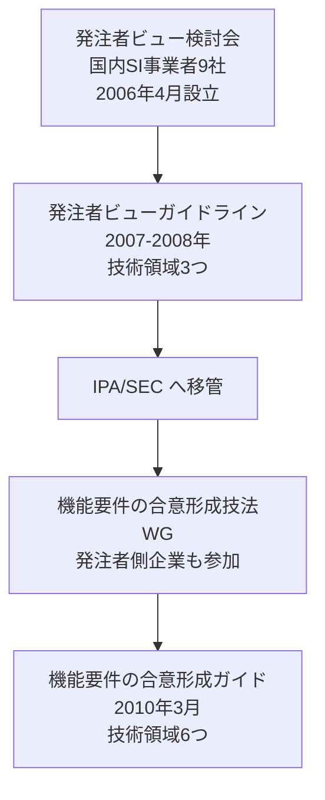

# 参照した一次情報

Processloop の要求仕様と設計に関する記法・方針の根拠となる一次情報をまとめる。

各文書の記述はここに挙げた資料にもとづく。**孫引きや二次情報ではなく、
一次資料そのものを参照すること。** 解釈に迷った場合も原典に当たる。

---

## 1. USDM（要求仕様の記述法）

USDM（Universal Specification Describing Manner）は清水吉男氏が提唱した記述法である。
派生開発推進協議会（AFFORDD）の T2 研究会が小冊子を公開している。

| 資料 | URL |
|---|---|
| AFFORDD 研究会 成果物一覧 | https://affordd.jp/previous/results.shtml |
| **USDM 小冊子 基礎編 ver 1.3**（2016） | https://affordd.jp/previous/tech_documents/affordd-t2-usdmtext-basic_1.3.pdf |
| **USDM 小冊子 付録編 ver 1.3**（2016） | https://affordd.jp/previous/tech_documents/affordd-t2-usdmtext-appendix_1.3.pdf |

### Processloop での採用範囲

基礎編から次を採用している。

- 要求・理由・説明・仕様グループ・仕様の5要素からなる階層構造
- 要求を動詞形の振る舞いとして書くこと
- 要求が持つ3つの役割（動きを感じさせる／範囲を示す／全ての動詞と目的語を見せる）
- 動詞が8個以上になったら要求を分割すること。分割の4型（時系列・構成・状態・共通）
- 避けるべき3表現（「等」「etc」／否定表現／ペースト作文）
- 仕様が満たすべき3条件（要求から導出される／設計をイメージできる／検証をイメージできる）

適用の詳細は [req/README.md](phase1/req/README.md) を参照。

⚠️ **小冊子の本文は転記していない。** 記法という方法論を採用しているにとどまる。

---

## 2. 機能要件の合意形成ガイド（IPA、2010年3月）

IPA/SEC の「機能要件の合意形成技法ワーキンググループ」が策定した。
発注者と開発者の不充分な合意形成が原因で下流工程に生じる手戻りを防ぐための
「コツ」を集めたもので、**対象工程は外部設計工程**である。

事業は2008年度から2009年度に実施された。

### 総合ページ

| 資料 | URL |
|---|---|
| **エンタプライズ系事業/機能要件の合意形成技法** | https://www.ipa.go.jp/archive/digital/iot-en-ci/jyouryuu/ent03-a.html |

背景、合意成熟度の3レベル、4つの作業、コツの定義と留意点、利用シーンが
まとめられている。**全体像を知るにはここから読むのが早い。**

### 各分冊（全7編）

「概要編」と6つの技術領域の分冊からなる。**概要編は技術領域ではない**点に注意する。

| # | 分冊 | URL |
|---|---|---|
| 1 | **概要編** | https://www.ipa.go.jp/archive/files/000004517.pdf |
| 2 | システム振舞い編 | https://www.ipa.go.jp/archive/files/000004525.pdf |
| 3 | 画面編 | https://www.ipa.go.jp/archive/files/000004521.pdf |
| 4 | データモデル編 | https://www.ipa.go.jp/archive/files/000004509.pdf |
| 5 | 外部インタフェース編 | https://www.ipa.go.jp/archive/files/000004513.pdf |
| 6 | バッチ編 | https://www.ipa.go.jp/archive/files/000004501.pdf |
| 7 | 帳票編 | https://www.ipa.go.jp/archive/files/000004505.pdf |

### 説明資料

| 資料 | URL |
|---|---|
| 「機能要件の合意形成ガイド」説明資料（PowerPoint、2011年6月） | https://www.ipa.go.jp/archive/files/000028868.ppt |

### Processloop での採用範囲

| 採用したもの | 反映先 |
|---|---|
| 6技術領域の区分 | Front Matter の `domains` |
| 合意成熟度の3レベル（仕掛・充実・完成） | Front Matter の `status` の意味づけ |
| 4つの作業の区分 | レビューの進め方 |
| 各技術領域が想定する工程成果物の名称 | [diagram-guide.md](phase1/req/diagram-guide.md) の記法割り当て |

### ⚠️ 使用条件

ガイドの著作権は IPA が保有する。著作権表示を明記すれば、
情報システム開発に携わる者が本目的のために無償で複製・再配布できるが、
**改変・翻案は禁じられている**。

したがって Processloop では**コツの本文を転記も言い換えもしていない**。
参照するのは著作物にあたらない事実（技術領域の区分、成熟度のレベル名、
作業の区分、工程成果物の名称）に限る。

[review-checklist.md](phase1/req/review-checklist.md) の30項目は、
コツの翻案ではなく独自に構成したものである。

**コツそのものを活用したい場合は、上記の PDF を直接参照すること。**

出典表記: 機能要件の合意形成ガイド ver.1.0、Copyright©2010 IPA

### ⚠️ 想定するプロジェクト規模

ガイドは 300ファンクションポイント以上、5000万円以上、10名以上、50人月以上を目安としている。
Processloop は個人プロジェクトであり、この想定から大きく外れる。

ただしガイド自身が、開発規模が小さくメンバも少ないプロジェクトでも
発注者と開発者の合意は必要であり、書き方とレビューのコツを参考にしてほしいと述べている。

---

## 3. 発注者ビューガイドライン（2007〜2008年）

機能要件の合意形成ガイドの前身にあたる。
国内 SI 事業者9社による「実践的アプローチに基づく要求仕様の発注者ビュー検討会」が策定し、
その後 IPA/SEC に移管された。

Web アプリケーション開発における外部設計工程で、発注者と受注者の
システム仕様に関する認識のずれを防ぐコツをまとめたものである。

### 構成

| 編 | 公開 |
|---|---|
| 画面編 | 2007年9月 |
| システム振舞い編 | 2008年3月 |
| データモデル編 | 2008年3月 |
| 概説編・用語集 | 2008年 |

### 現在の入手先

⚠️ **IPA の現行サイトに独立したページは存在しない。**
成果は機能要件の合意形成ガイド（2010）に引き継がれ、技術領域も3つから6つに拡張された。

したがって**参照すべきは後継である機能要件の合意形成ガイド**である。
前身の内容を確認する必要が生じた場合は、国立国会図書館のインターネット資料収集保存事業
（WARP）に保存された IPA 旧サイトのページから辿れる。

| 資料 | URL |
|---|---|
| 発注者ビューガイドライン（IPA 旧サイト、WARP 保存版） | https://warp.ndl.go.jp/web/20130117225954/http://sec.ipa.go.jp/reports/20080710.html |

⚠️ WARP は自動取得を許可していないため、ブラウザで直接開く必要がある。

### 系譜



<details>
<summary>ソースを見る</summary>

````markdown

````

</details>

---

## 4. その他の一次情報

### 移植元

| 資料 | URL |
|---|---|
| Process Dashboard（GitHub） | https://github.com/dtuma/processdash |
| Process Dashboard 公式サイト | https://www.processdash.com/ |

上流ピンは `bf5a4d63aff08410f79840001c816b37392e5001`（バージョン 2.7.6、2026-05-28）。

### 作図記法

| 資料 | URL |
|---|---|
| Mermaid 公式ドキュメント | https://mermaid.js.org/intro/ |
| Mermaid Requirement Diagram（SysML 1.6 準拠） | https://mermaid.js.org/syntax/requirementDiagram.html |
| draw.io の Mermaid 編集機能 | https://www.drawio.com/blog/mermaid-updates/ |

作図記法の選定理由は [ADR-0003](adr/adr-0003-diagram-notation.md) を参照。

---

## 5. 参照の原則

### 一次資料に当たる

本書に挙げた資料は、いずれも原典または公式の配布元である。
解説記事やブログ記事は参考にとどめ、**記法や方針の根拠にはしない**。

実際、調査の過程で二次情報に誤りが見つかった。
機能要件の合意形成ガイドの技術領域を7つとする記述や、
対象工程を要件定義とする記述が該当する。**いずれも一次資料で訂正した**。

### 著作権に配慮する

方法論や構造は採用してよいが、**本文の転記と翻案は避ける**。
特に機能要件の合意形成ガイドは改変・翻案を明示的に禁じている。

Processloop の文書に書かれた観点やチェックリストは、
一次資料を読んだうえで**独自に構成したもの**である。

### リンクの確認方法

⚠️ **コマンドラインのツールでは 403 が返る場合がある。** IPA、AFFORDD、Mermaid の各サイトは
自動取得を制限しているため、`curl` や `wget` での到達確認は当てにならない。
**ブラウザで開いて確認する。**

本書に記載した URL は、2026-08-10 時点でブラウザ相当の取得により内容を確認している。

### URL の陳腐化に備える

IPA のサイトは改組により URL が変わることがある。
実際、旧 `sec.ipa.go.jp` のページは現在 `www.ipa.go.jp/archive/` 配下に移っている。

リンク切れが生じた場合は、資料名で検索するか、
IPA のアーカイブトップから辿る。

| 資料 | URL |
|---|---|
| IPA アーカイブ トップ | https://www.ipa.go.jp/archive/index.html |
| システム構築の上流工程強化 | https://www.ipa.go.jp/archive/digital/iot-en-ci/jyouryuu/index.html |
